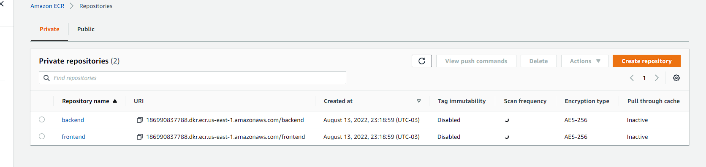

[repositorio](https://github.com/Lautarodamore/aws-eks-fargate-workshop)
[parte 1](https://github.com/Lautarodamore/aws-eks-fargate-workshop)
[parte 3](https://github.com/Lautarodamore/aws-eks-fargate-workshop)

### Crear un registry en AWS ECR para nuestras imagenes de frontend y backend

Necesitaremos deployar las imagenes de nuestro frontend y backend al registry de amazon (ECR) para que nuestros pods puedan tomar pullear esas imagenes.

<aside>
> 💡 El **registry** es como un repositorio para las imagenes de docker que armamos. En este caso utilizaremos AWS ECR para almacenar las versiones de nuestras imagenes.

</aside>

Para crear el recurso `ECR` debemos crear el siguiente archivo `terraform/9-ecr.tf`:

```
resource "aws_ecr_repository" "frontend" {
  name = "frontend"
}

resource "aws_ecr_repository" "backend" {
  name = "backend"
}
```

Pusheamos para correr el pipeline y si vamos a nuestro ECR deberiamos ver lo siguiente:



### Pushear nuestras imagenes del frontend y backend

Para el frontend crearemos una aplicacion simple de `NextJS` y para nuestro backend un servidor HTTP simple con `Kotlin`. El codigo del frontend y backend pueden copiarlo del [repositorio](https://github.com/Lautarodamore/aws-eks-fargate-workshop) de este tutorial, lo que veremos aqui es como crear los Dockerfile y como pushear las imagenes al registry con `GitHub Actions`.

**Backend**

Una vez que ya tengamos el codigo de nuestro backend (tomar de referencia el del repositorio), debemos crear el siguiente `Dockerfile` para construir la imagen de nuestro back.

```docker
FROM gradle:7.2.0-jdk16 as builder

USER root
ARG COMMIT_SHA

ADD . .

RUN printf %s ".${COMMIT_SHA}" >> VERSION

RUN gradle --parallel --build-cache -Dorg.gradle.console=plain -Dorg.gradle.daemon=false :shadowJar

###########################################################################
FROM openjdk:16-alpine

ENV PORT 6060

WORKDIR /app

COPY --from=builder /home/gradle/build/libs/backend_api.jar backend_api.jar

EXPOSE $PORT

CMD java -Xms256m -Xmx256m -Xss512k -jar backend_api.jar
```

Y dentro de la carpeta `.github/workflows` crearemos el archivo `backend.yml` para pushear nuestra imagen al registry de amazon previamente creado para nuestro backend.

```yaml
on:
  push:
    branches:
      - main
    paths:
      - backend/*
      - .github/workflows/backend.yml

jobs:
  backend-push-image:
    runs-on: ubuntu-latest
    env:
      AWS_ACCESS_KEY_ID: ${{ secrets.AWS_ACCESS_KEY_ID }}
      AWS_SECRET_ACCESS_KEY: ${{ secrets.AWS_SECRET_ACCESS_KEY }}
    steps:
      - name: Checkout repository
        uses: actions/checkout@v2
      - name: Deploy api
        run: |
          cd backend
          echo "Build docker image"
          docker build --tag backend:latest --build-arg COMMIT_SHA=${GITHUB_SHA} .
          echo "Push image to ECR"
          docker run --rm -e AWS_ACCESS_KEY_ID=${AWS_ACCESS_KEY_ID} -e AWS_SECRET_ACCESS_KEY=${AWS_SECRET_ACCESS_KEY} amazon/aws-cli ecr get-login-password --region us-east-1 | docker login --username AWS --password-stdin 186990837788.dkr.ecr.us-east-1.amazonaws.com/backend
          docker tag backend:latest 186990837788.dkr.ecr.us-east-1.amazonaws.com/backend:latest
          docker push 186990837788.dkr.ecr.us-east-1.amazonaws.com/backend
```

La funcion de este archivo es que cada vez que se modifique el backend, se active el pipeline para pushear la nueva imagen del backend al registry de amazon. Una vez que pusheemos podemos corroborrar que en repositorio de nuestra imagen en ECR esta la imagen buildeada.

**Frontend**

Una vez que ya tengamos el codigo de nuestro frontend (tomar de referencia el del repositorio), debemos crear el siguiente `Dockerfile` para construir la imagen de nuestro front.

```docker
# Install dependencies only when needed
FROM node:16-alpine AS deps
# Check https://github.com/nodejs/docker-node/tree/b4117f9333da4138b03a546ec926ef50a31506c3#nodealpine to understand why libc6-compat might be needed.
RUN apk add --no-cache libc6-compat
WORKDIR /app

# Install dependencies based on the preferred package manager
COPY package.json yarn.lock* package-lock.json* pnpm-lock.yaml* ./
RUN \
  if [ -f yarn.lock ]; then yarn --frozen-lockfile; \
  elif [ -f package-lock.json ]; then npm ci; \
  elif [ -f pnpm-lock.yaml ]; then yarn global add pnpm && pnpm i; \
  else echo "Lockfile not found." && exit 1; \
  fi

# Rebuild the source code only when needed
FROM node:16-alpine AS builder
WORKDIR /app
COPY --from=deps /app/node_modules ./node_modules
COPY . .

# Next.js collects completely anonymous telemetry data about general usage.
# Learn more here: https://nextjs.org/telemetry
# Uncomment the following line in case you want to disable telemetry during the build.
# ENV NEXT_TELEMETRY_DISABLED 1

RUN yarn build

# If using npm comment out above and use below instead
# RUN npm run build

# Production image, copy all the files and run next
FROM node:16-alpine AS runner
WORKDIR /app

ENV NODE_ENV production
# Uncomment the following line in case you want to disable telemetry during runtime.
# ENV NEXT_TELEMETRY_DISABLED 1

RUN addgroup --system --gid 1001 nodejs
RUN adduser --system --uid 1001 nextjs

# You only need to copy next.config.js if you are NOT using the default configuration
# COPY --from=builder /app/next.config.js ./
COPY --from=builder /app/public ./public
COPY --from=builder /app/package.json ./package.json

# Automatically leverage output traces to reduce image size
# https://nextjs.org/docs/advanced-features/output-file-tracing
COPY --from=builder --chown=nextjs:nodejs /app/.next/standalone ./
COPY --from=builder --chown=nextjs:nodejs /app/.next/static ./.next/static

USER nextjs

EXPOSE 3000

ENV PORT 3000

CMD ["node", "server.js"]
```

Y dentro de la carpeta `.github/workflows` crearemos el archivo `frontend.yml` para pushear nuestra imagen al registry de amazon previamente creado para nuestro backend.

```yaml
on:
  push:
    branches:
      - main
    paths:
      - frontend/*
      - .github/workflows/frontend.yml

jobs:
  frontend-push-image:
    runs-on: ubuntu-latest
    env:
      AWS_ACCESS_KEY_ID: ${{ secrets.AWS_ACCESS_KEY_ID }}
      AWS_SECRET_ACCESS_KEY: ${{ secrets.AWS_SECRET_ACCESS_KEY }}
    steps:
      - name: Checkout repository
        uses: actions/checkout@v2
      - name: Push frontend image
        run: |
          cd frontend
          echo "Build docker image"
          docker build --tag frontend:latest --build-arg COMMIT_SHA=${GITHUB_SHA} .
          echo "Push image to ECR"
          docker run --rm -e AWS_ACCESS_KEY_ID=${AWS_ACCESS_KEY_ID} -e AWS_SECRET_ACCESS_KEY=${AWS_SECRET_ACCESS_KEY} amazon/aws-cli ecr get-login-password --region us-east-1 | docker login --username AWS --password-stdin 186990837788.dkr.ecr.us-east-1.amazonaws.com/frontend
          docker tag frontend:latest 186990837788.dkr.ecr.us-east-1.amazonaws.com/frontend:latest
          docker push 186990837788.dkr.ecr.us-east-1.amazonaws.com/frontend
```

La funcion de este archivo es que cada vez que se modifique el frontend, se active el pipeline para pushear la nueva imagen del frontend al registry de amazon. Una vez que pusheemos podemos corroborrar que en repositorio de nuestra imagen en ECR esta la imagen buildeada.

### Desplegar nuestros pods

El proximo paso es desplegar nuestro backend y frontend a nuestro cluster. Para eso debemos crear otro Fargate profile, ya que nuestro pods estaran en un namespace diferente al de kube-system. Recordemos que por cada namespace necesitamos un Fargate profile para otorgarle privilegios a Fargate para que pueda crear nodos y asignarlos a nuestros pods.

<aside>
> 💡 Un pod es la unidad de ejecucion basica de una aplicacion kubernetes. Es la mas pequeña y simple unidad que podes crear o deployar.
Un pod es un ambiente para los containers. Generalmente organizamos las partes de nuestra aplicacion en distintos pods (server, database, apis, caching).
Un pod tiene una ip, memoria, volumenes, etc.

</aside>

Para crear el Fargate profile crearemos el archivo `terraform/8-staging-profile.tf` con lo siguiente:

```
resource "aws_eks_fargate_profile" "staging" {
  cluster_name           = aws_eks_cluster.cluster.name
  fargate_profile_name   = "staging"
  pod_execution_role_arn = aws_iam_role.eks-fargate-profile.arn

  # These subnets must have the following resource tag:
  # kubernetes.io/cluster/<CLUSTER_NAME>.
  subnet_ids = [
    aws_subnet.private-us-east-1a.id,
    aws_subnet.private-us-east-1b.id
  ]

  selector {
    namespace = "staging"
  }
}
```

En la raiz del proyecto crearemos una carpeta llamada k8s y ahi escribiremos nuestros archivos de Kubernetes.

Primero el namespace de staging en `k8s/amespace.yaml`:

```yaml
---
apiVersion: v1
kind: Namespace
metadata:
  name: staging
```

El frontend en `k8s/rontend-deployent.yaml`:

```yaml
---
apiVersion: apps/v1
kind: Deployment
metadata:
  name: frontend
  namespace: staging
spec:
  selector:
    matchLabels:
      run: frontend
  # remove replica if using gitops
  replicas: 1
  template:
    metadata:
      labels:
        run: frontend
    spec:
      containers:
        - name: frontend
          image: 186990837788.dkr.ecr.us-east-1.amazonaws.com/frontend # Es importante colocar la direccion de su registry
          ports:
            - containerPort: 3000
          resources:
            limits:
              cpu: 200m
              memory: 256Mi
            requests:
              cpu: 200m
              memory: 256Mi
```

Y el backend en `backend-deployment.yaml`:

```yaml
---
apiVersion: apps/v1
kind: Deployment
metadata:
  name: backend
  namespace: staging
spec:
  selector:
    matchLabels:
      run: backend
  # remove replica if using gitops
  replicas: 1
  template:
    metadata:
      labels:
        run: backend
    spec:
      containers:
        - name: backend
          image: 186990837788.dkr.ecr.us-east-1.amazonaws.com/backend # Es importante colocar la direccion de su registry
          ports:
            - containerPort: 6060
          resources:
            limits:
              cpu: 200m
              memory: 256Mi
            requests:
              cpu: 200m
              memory: 256Mi
```

Para probar que nuestros archivos esten correctos, podemos aplicarlos con kubectl antes de automatizar este proceso. Para eso debemos correr los siguientes comandos.

```bash
ldamore@Desktop/aws-eks-fargate:~ kubectl apply -f k8s/namespace.yaml
ldamore@Desktop/aws-eks-fargate:~ kubectl apply -f k8s/frontend-deployment.yaml
ldamore@Desktop/aws-eks-fargate:~ kubectl apply -f k8s/backend-deployment.yaml
```

Luego de unos minutos si ejecutamos el comando `kubectl get pods -n staging` podemos ver que nuestros pods ya estan deployados.

Ahora para automatizar este proceso debemos modificar nuestros archivos `.github/workflows/backend.yml` y `.github/workflows/frontend.yml` lo que se agrega a estos archivos es la configuracion de aws-cli, la instalacion de kubectl, actualizar kube config para que kubectl este apuntando a nuestro cluster y por ultimo aplicar los archivos correspondientes de kubernetes.

Dentro de `.github/workflows/frontend.yml`:

```yaml
on:
  push:
    branches:
      - main
    paths:
      - frontend/*
      - .github/workflows/frontend.yml

jobs:
  frontend-push-image:
    runs-on: ubuntu-latest
    env:
      AWS_ACCESS_KEY_ID: ${{ secrets.AWS_ACCESS_KEY_ID }}
      AWS_SECRET_ACCESS_KEY: ${{ secrets.AWS_SECRET_ACCESS_KEY }}
    steps:
      - name: Checkout repository
        uses: actions/checkout@v2
      - name: Install kubectl
        uses: azure/setup-kubectl@v1
        with:
          version: 'v1.21.3'
        id: install
      - name: Configure AWS credentials
        uses: aws-actions/configure-aws-credentials@v1
        with:
          aws-access-key-id: ${{ secrets.AWS_ACCESS_KEY_ID }}
          aws-secret-access-key: ${{ secrets.AWS_SECRET_ACCESS_KEY }}
          aws-region: us-east-1
      - name: Push frontend image
        run: |
          cd frontend
          echo "Build docker image"
          docker build --tag frontend:latest --build-arg COMMIT_SHA=${GITHUB_SHA} .
          echo "Push image to ECR"
          docker run --rm -e AWS_ACCESS_KEY_ID=${AWS_ACCESS_KEY_ID} -e AWS_SECRET_ACCESS_KEY=${AWS_SECRET_ACCESS_KEY} amazon/aws-cli ecr get-login-password --region us-east-1 | docker login --username AWS --password-stdin 186990837788.dkr.ecr.us-east-1.amazonaws.com/frontend
          docker tag frontend:latest 186990837788.dkr.ecr.us-east-1.amazonaws.com/frontend:latest
          docker push 186990837788.dkr.ecr.us-east-1.amazonaws.com/frontend
      - name: Update kube config
        run: aws eks update-kubeconfig --name demo --region us-east-1
      - name: Deploy image to Amazon EKS
        run: |
          kubectl apply -f k8s/frontend-deployment.yaml
```

Dentro de `.github/workflows/backend.yml`:

```yaml
on:
  push:
    branches:
      - main
    paths:
      - backend/*
      - .github/workflows/backend.yml

jobs:
  backend-push-image:
    runs-on: ubuntu-latest
    env:
      AWS_ACCESS_KEY_ID: ${{ secrets.AWS_ACCESS_KEY_ID }}
      AWS_SECRET_ACCESS_KEY: ${{ secrets.AWS_SECRET_ACCESS_KEY }}
    steps:
      - name: Checkout repository
        uses: actions/checkout@v2
      - name: Install kubectl
        uses: azure/setup-kubectl@v1
        with:
          version: 'v1.21.3'
        id: install
      - name: Configure AWS credentials
        uses: aws-actions/configure-aws-credentials@v1
        with:
          aws-access-key-id: ${{ secrets.AWS_ACCESS_KEY_ID }}
          aws-secret-access-key: ${{ secrets.AWS_SECRET_ACCESS_KEY }}
          aws-region: us-east-1
      - name: Push backend image
        run: |
          cd backend
          echo "Build docker image"
          docker build --tag backend:latest --build-arg COMMIT_SHA=${GITHUB_SHA} .
          echo "Push image to ECR"
          docker run --rm -e AWS_ACCESS_KEY_ID=${AWS_ACCESS_KEY_ID} -e AWS_SECRET_ACCESS_KEY=${AWS_SECRET_ACCESS_KEY} amazon/aws-cli ecr get-login-password --region us-east-1 | docker login --username AWS --password-stdin 186990837788.dkr.ecr.us-east-1.amazonaws.com/backend
          docker tag backend:latest 186990837788.dkr.ecr.us-east-1.amazonaws.com/backend:latest
          docker push 186990837788.dkr.ecr.us-east-1.amazonaws.com/backend
      - name: Update kube config
        run: aws eks update-kubeconfig --name demo --region us-east-1
      - name: Deploy image to Amazon EKS
        run: |
          kubectl apply -f k8s/backend-deployment.yaml
```

### Crear servicios para nuestros pods

Es tiempo de crear servicios a nuestros pods para que proximamente esten expuestos a internet a traves de un ingress.

<aside>
> 💡 Un servicio provee un "**single point of entry**" para acceder a uno o mas pods.
Los pods viven y mueren todo el tiempo, cada pod tiene su ip, y esto es un problema, ya que no podemos confiar en la ip de un pod porque probablemente, esta cambie.
El rol de los servicios es abstraer la pod ip de los consumidores.

</aside>

Dentro de la carpeta k8s crearemos un archivo `frontend-service.yaml` y otro `backend-service.yaml`

En `k8s/frontend-service.yaml`

```yaml
apiVersion: v1
kind: Service
metadata:
  name: frontend
  namespace: staging
  labels:
    app: frontend
spec:
  type: NodePort
  selector:
    app: frontend
  ports:
    - port: 80
      targetPort: 3000
```

Y en `k8s/backend-service.yaml`

```yaml
apiVersion: v1
kind: Service
metadata:
  name: backend
  namespace: staging
  labels:
    app: backend
spec:
  type: NodePort
  selector:
    app: backend
  ports:
    - port: 80
      targetPort: 6060
```

Para crear los servicios deberemos agregar
en: `.github/workflows/backend.yml`

luego de la linea para aplicar el deployment, la siguiente linea `kubectl apply -f k8s/backend-service.yaml`

y en:  `.github/workflows/frontend.yml`

luego de la linea para aplicar el deployment, la siguiente linea `kubectl apply -f k8s/frontend-service.yaml`

Para poder ver los servicios que creamos podemos ejecutar `kubectl get services -n staging`

### Mejorar la estabilidad de nuestros pods con Pod Disruption Budget

Amazon EKS debe periodicamente patchear los pods que corren en nodos de AWS Fargate para mantenerlos seguros. A veces esto significa que los pods necesitan ser recreados. Para limitar el impacto en nuestra aplicacion debemos crear un pod disruption budget apropiado para controlar el numero de pods que estan caidos al mismo tiempo.

Para eso dentro de la carpeta k8s crearemos los siguientes archivos:

`k8s/frontend-pdb.yaml`:

```yaml
---
apiVersion: policy/v1
kind: PodDisruptionBudget
metadata:
  name: frontend
  namespace: staging
spec:
  maxUnavailable: 1
  selector:
    matchLabels:
      run: frontend
```

`k8s/ackend-pdb.yaml`:

```yaml
---
apiVersion: policy/v1
kind: PodDisruptionBudget
metadata:
  name: backend
  namespace: staging
spec:
  maxUnavailable: 1
  selector:
    matchLabels:
      run: backend
```

Para crear los pod disruption badgets deberemos agregar
en: `.github/workflows/backend.yml`

luego de la linea para aplicar el service, la siguiente linea `kubectl apply -f k8s/backend-pdb.yaml`

y en:  `.github/workflows/frontend.yml`

luego de la linea para aplicar el service, la siguiente linea `kubectl apply -f k8s/frontend-pdb.yaml`

Para poder ver los servicios que creamos podemos ejecutar `kubectl get pdb -n staging`

### Crear IAM OIDC provider usando Terraform

Podemos asociar un IAM role a una **Kubernetes service account**. Esta service account puede proveer AWS permissions a los container en cualquier pod que este usando esa service account.

<aside>
> 💡 Una service accounte provee identidad a ciertos procesos que corren en un Pod

</aside>

Con este feature no es mas necesario configurar a mano los permisos de los nodos para que los pods puedan hacer llamadas a **AWS APIs**.
Esta service account la necesitaremos para un pod que va a necesitar tener permisos para crear load balancers.

Para eso dentro de la carpeta k8s crearemos el archivo `10-iam-oidc.tf` :

```
data "tls_certificate" "eks" {
  url = aws_eks_cluster.cluster.identity[0].oidc[0].issuer
}

resource "aws_iam_openid_connect_provider" "eks" {
  client_id_list  = ["sts.amazonaws.com"]
  thumbprint_list = [data.tls_certificate.eks.certificates[0].sha1_fingerprint]
  url             = aws_eks_cluster.cluster.identity[0].oidc[0].issuer
}
```

Una vez que pusheamos podemos corroborrar que se se creo el IAM OIDC provider con el siguiente comando

```bash
aws iam list-open-id-connect-providers
```

### Desplegat AWS Load Balancer Controller usando Terraform

El proximo paso es deployar un **AWS Load Balancer controller,** pero primero, necesitamos un IAM role y establecer confianza con la Kubernetes service account.

Tendremos un pod con este **AWS Load Balancer controller** que estara viendo cuando se crea un ingress, en el momento que se crea un ingress, el pod creara un Application Load Balancer basandose en la definicion del ingress. Es por eso que necesitamos establecer confianza con la Kubernetes service account, para que permita a este pod crear recursos como el Application Load Balancer.

Crearemos el archivo `terraform/11-iam-lb-controller.tf`:

```
data "aws_iam_policy_document" "aws_load_balancer_controller_assume_role_policy" {
  statement {
    actions = ["sts:AssumeRoleWithWebIdentity"]
    effect  = "Allow"

    condition {
      test     = "StringEquals"
      variable = "${replace(aws_iam_openid_connect_provider.eks.url, "https://", "")}:sub"
      values   = ["system:serviceaccount:kube-system:aws-load-balancer-controller"]
    }

    principals {
      identifiers = [aws_iam_openid_connect_provider.eks.arn]
      type        = "Federated"
    }
  }
}

resource "aws_iam_role" "aws_load_balancer_controller" {
  assume_role_policy = data.aws_iam_policy_document.aws_load_balancer_controller_assume_role_policy.json
  name               = "aws-load-balancer-controller"
}

resource "aws_iam_policy" "aws_load_balancer_controller" {
  policy = file("./AWSLoadBalancerController.json")
  name   = "AWSLoadBalancerController"
}

resource "aws_iam_role_policy_attachment" "aws_load_balancer_controller_attach" {
  role       = aws_iam_role.aws_load_balancer_controller.name
  policy_arn = aws_iam_policy.aws_load_balancer_controller.arn
}

output "aws_load_balancer_controller_role_arn" {
  value = aws_iam_role.aws_load_balancer_controller.arn
}
```

Ademas debemos crear el archivo **AWSLoadBalancerController.json** que tendra la policy con los permisos necesarios para el IAM role.

Dentro de la carpeta terraform crear `terraform/AWSLoadBalancerController.json`:

```json
{
    "Version": "2012-10-17",
    "Statement": [
        {
            "Effect": "Allow",
            "Action": [
                "iam:CreateServiceLinkedRole"
            ],
            "Resource": "*",
            "Condition": {
                "StringEquals": {
                    "iam:AWSServiceName": "elasticloadbalancing.amazonaws.com"
                }
            }
        },
        {
            "Effect": "Allow",
            "Action": [
                "ec2:DescribeAccountAttributes",
                "ec2:DescribeAddresses",
                "ec2:DescribeAvailabilityZones",
                "ec2:DescribeInternetGateways",
                "ec2:DescribeVpcs",
                "ec2:DescribeVpcPeeringConnections",
                "ec2:DescribeSubnets",
                "ec2:DescribeSecurityGroups",
                "ec2:DescribeInstances",
                "ec2:DescribeNetworkInterfaces",
                "ec2:DescribeTags",
                "ec2:GetCoipPoolUsage",
                "ec2:DescribeCoipPools",
                "elasticloadbalancing:DescribeLoadBalancers",
                "elasticloadbalancing:DescribeLoadBalancerAttributes",
                "elasticloadbalancing:DescribeListeners",
                "elasticloadbalancing:DescribeListenerCertificates",
                "elasticloadbalancing:DescribeSSLPolicies",
                "elasticloadbalancing:DescribeRules",
                "elasticloadbalancing:DescribeTargetGroups",
                "elasticloadbalancing:DescribeTargetGroupAttributes",
                "elasticloadbalancing:DescribeTargetHealth",
                "elasticloadbalancing:DescribeTags"
            ],
            "Resource": "*"
        },
        {
            "Effect": "Allow",
            "Action": [
                "cognito-idp:DescribeUserPoolClient",
                "acm:ListCertificates",
                "acm:DescribeCertificate",
                "iam:ListServerCertificates",
                "iam:GetServerCertificate",
                "waf-regional:GetWebACL",
                "waf-regional:GetWebACLForResource",
                "waf-regional:AssociateWebACL",
                "waf-regional:DisassociateWebACL",
                "wafv2:GetWebACL",
                "wafv2:GetWebACLForResource",
                "wafv2:AssociateWebACL",
                "wafv2:DisassociateWebACL",
                "shield:GetSubscriptionState",
                "shield:DescribeProtection",
                "shield:CreateProtection",
                "shield:DeleteProtection"
            ],
            "Resource": "*"
        },
        {
            "Effect": "Allow",
            "Action": [
                "ec2:AuthorizeSecurityGroupIngress",
                "ec2:RevokeSecurityGroupIngress"
            ],
            "Resource": "*"
        },
        {
            "Effect": "Allow",
            "Action": [
                "ec2:CreateSecurityGroup"
            ],
            "Resource": "*"
        },
        {
            "Effect": "Allow",
            "Action": [
                "ec2:CreateTags"
            ],
            "Resource": "arn:aws:ec2:*:*:security-group/*",
            "Condition": {
                "StringEquals": {
                    "ec2:CreateAction": "CreateSecurityGroup"
                },
                "Null": {
                    "aws:RequestTag/elbv2.k8s.aws/cluster": "false"
                }
            }
        },
        {
            "Effect": "Allow",
            "Action": [
                "ec2:CreateTags",
                "ec2:DeleteTags"
            ],
            "Resource": "arn:aws:ec2:*:*:security-group/*",
            "Condition": {
                "Null": {
                    "aws:RequestTag/elbv2.k8s.aws/cluster": "true",
                    "aws:ResourceTag/elbv2.k8s.aws/cluster": "false"
                }
            }
        },
        {
            "Effect": "Allow",
            "Action": [
                "ec2:AuthorizeSecurityGroupIngress",
                "ec2:RevokeSecurityGroupIngress",
                "ec2:DeleteSecurityGroup"
            ],
            "Resource": "*",
            "Condition": {
                "Null": {
                    "aws:ResourceTag/elbv2.k8s.aws/cluster": "false"
                }
            }
        },
        {
            "Effect": "Allow",
            "Action": [
                "elasticloadbalancing:CreateLoadBalancer",
                "elasticloadbalancing:CreateTargetGroup"
            ],
            "Resource": "*",
            "Condition": {
                "Null": {
                    "aws:RequestTag/elbv2.k8s.aws/cluster": "false"
                }
            }
        },
        {
            "Effect": "Allow",
            "Action": [
                "elasticloadbalancing:CreateListener",
                "elasticloadbalancing:DeleteListener",
                "elasticloadbalancing:CreateRule",
                "elasticloadbalancing:DeleteRule"
            ],
            "Resource": "*"
        },
        {
            "Effect": "Allow",
            "Action": [
                "elasticloadbalancing:AddTags",
                "elasticloadbalancing:RemoveTags"
            ],
            "Resource": [
                "arn:aws:elasticloadbalancing:*:*:targetgroup/*/*",
                "arn:aws:elasticloadbalancing:*:*:loadbalancer/net/*/*",
                "arn:aws:elasticloadbalancing:*:*:loadbalancer/app/*/*"
            ],
            "Condition": {
                "Null": {
                    "aws:RequestTag/elbv2.k8s.aws/cluster": "true",
                    "aws:ResourceTag/elbv2.k8s.aws/cluster": "false"
                }
            }
        },
        {
            "Effect": "Allow",
            "Action": [
                "elasticloadbalancing:AddTags",
                "elasticloadbalancing:RemoveTags"
            ],
            "Resource": [
                "arn:aws:elasticloadbalancing:*:*:listener/net/*/*/*",
                "arn:aws:elasticloadbalancing:*:*:listener/app/*/*/*",
                "arn:aws:elasticloadbalancing:*:*:listener-rule/net/*/*/*",
                "arn:aws:elasticloadbalancing:*:*:listener-rule/app/*/*/*"
            ]
        },
        {
            "Effect": "Allow",
            "Action": [
                "elasticloadbalancing:ModifyLoadBalancerAttributes",
                "elasticloadbalancing:SetIpAddressType",
                "elasticloadbalancing:SetSecurityGroups",
                "elasticloadbalancing:SetSubnets",
                "elasticloadbalancing:DeleteLoadBalancer",
                "elasticloadbalancing:ModifyTargetGroup",
                "elasticloadbalancing:ModifyTargetGroupAttributes",
                "elasticloadbalancing:DeleteTargetGroup"
            ],
            "Resource": "*",
            "Condition": {
                "Null": {
                    "aws:ResourceTag/elbv2.k8s.aws/cluster": "false"
                }
            }
        },
        {
            "Effect": "Allow",
            "Action": [
                "elasticloadbalancing:RegisterTargets",
                "elasticloadbalancing:DeregisterTargets"
            ],
            "Resource": "arn:aws:elasticloadbalancing:*:*:targetgroup/*/*"
        },
        {
            "Effect": "Allow",
            "Action": [
                "elasticloadbalancing:SetWebAcl",
                "elasticloadbalancing:ModifyListener",
                "elasticloadbalancing:AddListenerCertificates",
                "elasticloadbalancing:RemoveListenerCertificates",
                "elasticloadbalancing:ModifyRule"
            ],
            "Resource": "*"
        }
    ]
}
```

Por ultimo creamos la controller usando **Helm,** ya que la definicion para el pod ya esta hecha por **AWS.**

<aside>
> 💡 **Helm** es una herramienta que te ayuda a automatizar la creacion, empaquetamiento, configuracion y despliegue de aplicaciones y servicios de Kubernetes. Con **Helm** podremos levantantar en nuestro cluster aplicaciones ya definidas y no tener que crearlas desde cero.

</aside>

Creamos el archivo `terraform/12-lb-controller.tf`

```
provider "helm" {
  kubernetes {
    host                   = aws_eks_cluster.cluster.endpoint
    cluster_ca_certificate = base64decode(aws_eks_cluster.cluster.certificate_authority[0].data)
    exec {
      api_version = "client.authentication.k8s.io/v1beta1"
      args        = ["eks", "get-token", "--cluster-name", aws_eks_cluster.cluster.id]
      command     = "aws"
    }
  }
}

resource "helm_release" "aws-load-balancer-controller" {
  name = "aws-load-balancer-controller"

  repository = "https://aws.github.io/eks-charts"
  chart      = "aws-load-balancer-controller"
  namespace  = "kube-system"
  version    = "1.4.1"

  set {
    name  = "clusterName"
    value = aws_eks_cluster.cluster.id
  }

  set {
    name  = "image.tag"
    value = "v2.4.2"
  }

  set {
    name  = "replicaCount"
    value = 1
  }

  set {
    name  = "serviceAccount.name"
    value = "aws-load-balancer-controller"
  }

  set {
    name  = "serviceAccount.annotations.eks\\.amazonaws\\.com/role-arn"
    value = aws_iam_role.aws_load_balancer_controller.arn
  }

  # EKS Fargate specific
  set {
    name  = "region"
    value = "us-east-1"
  }

  set {
    name  = "vpcId"
    value = aws_vpc.main.id
  }

  depends_on = [aws_eks_fargate_profile.kube-system]
}
```

Pusheamos para que se apliquen los cambios en terraform.

Si corremos el comando `kubectl get pods -n kube-system`, veremos que ya tenemos nuestro pod con la AWS Load Balancer Controller:
