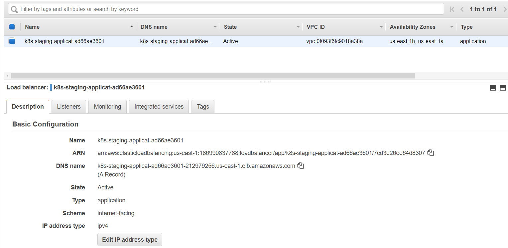
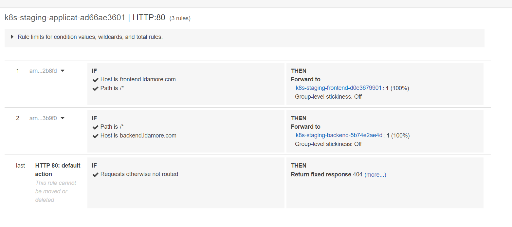
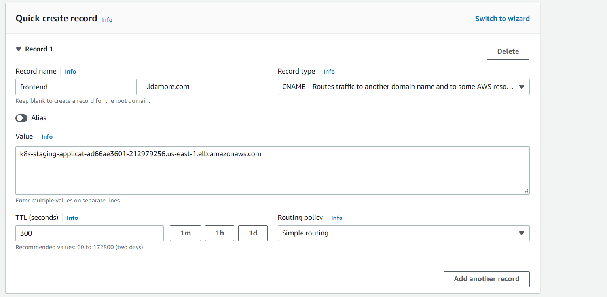
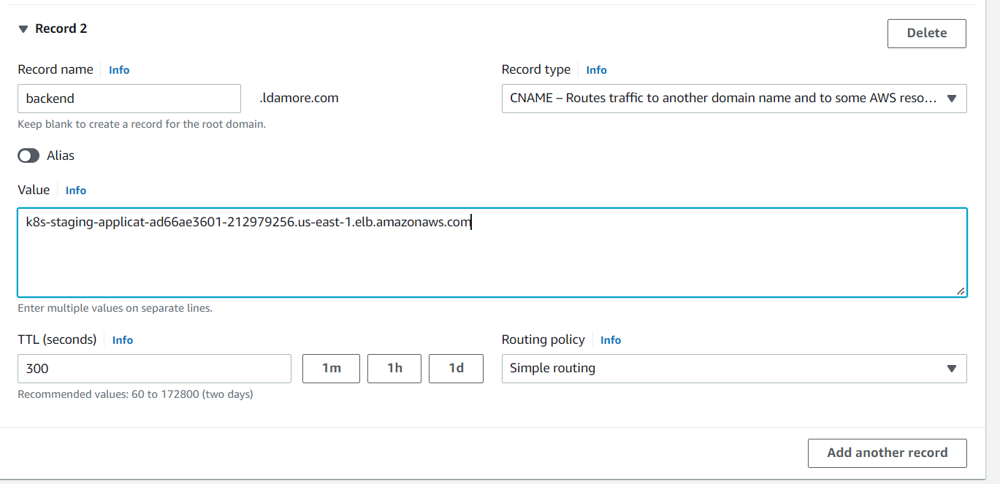
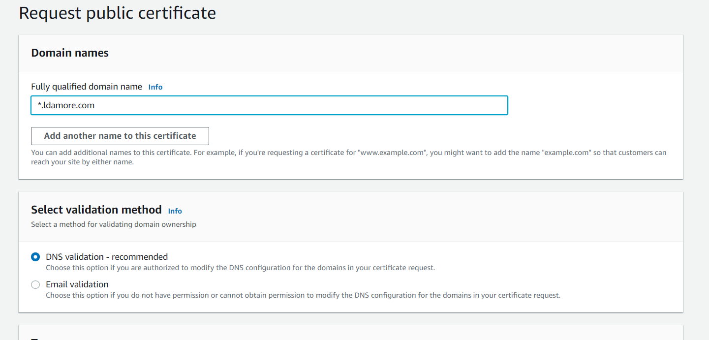

[repositorio](https://github.com/Lautarodamore/aws-eks-fargate-workshop)
[parte 1](https://github.com/Lautarodamore/aws-eks-fargate-workshop)
[parte 3](https://github.com/Lautarodamore/aws-eks-fargate-workshop)

### Create a Ingress for our pods (backend and frontend)

Lo siguiente es crear un ingress para exponer nuestro frontend y backend usando **AWS Load Balancer controller.** Primero sera http plano, luego podremos adjuntar certificados para habilitar **TLS**.

<aside>
> 💡 Es un objeto que maneja el acceso externo a los servicios en el cluster, tipicamente HTTP
El ingress expone rutas HTTP y HTTPS de afuera del cluster a los servicios dentro del cluster. El trafico de rutas es controlado por reglas que se definen en el ingress

</aside>

Por defecto **AWS Load Balancer controller** creara load balancer con solo con private IPs. Solo pueden ser accedidos mediante nuestra VPC. Para cambiar eso, podemos usar annotations. En general los Load Balancer de AWS soportan dos modos. Instance mode y IP mode. AWS Fargate solo puede ser usado con IP mode. Esto creara un target group en AWS y usara la IP del pod para redigir la ruta.

Dentro de la carpeta k8s/ crear el siguiente archivo `ingress.yaml`

```yaml
apiVersion: networking.k8s.io/v1
kind: Ingress
metadata:
  name: application-ingress
  namespace: staging
  annotations:
    alb.ingress.kubernetes.io/scheme: internet-facing
    alb.ingress.kubernetes.io/target-type: ip
spec:
  ingressClassName: alb
  rules:
    - host: frontend.ldamore.com
      http:
        paths:
          - path: /
            pathType: Prefix
            backend:
              service:
                name: frontend
                port:
                  number: 80
    - host: backend.ldamore.com
      http:
        paths:
          - path: /
            pathType: Prefix
            backend:
              service:
                name: backend
                port:
                  number: 80
```

Una vez aplicado este ingress podemos verlo con el comando `kubectl get ing -n staging`

El pod con el **Load Balancer Controller** creara un ALB en base al ingress creado.

Si vamos a EC2 y luego a Load balancer podemos ver que tenemos un nuevo ALB



Y si vemos los listeners podemos ver que estan creadas las reglas correspondientes para cada host



### Adjuntar dominios al ALB

Para adjuntar nuestros subdominios al Application Load Balancer debemos ir a Route53 y crear nuevos records. Recuerde poner de Record name los hosts declarados en el ingress y de Value poner el DNS name del Application Load Balancer.





### Secure Ingress con SSL/TLS

Para habilitar **TLS** debemos ir a AWS Certificate Manager y pedir un certificado.

En el dominio pondremos un * asi funciona el certificado tanto para el frontend como para el backend.

En mi caso:


Una vez creado el certificado nos aparecera un boton para agregar los Record names automaticamente en Route 53.

Creado los records, luego de unos minutos el certificado deberia estar **issued.**

Y dentro del archivo `k8s/ingress.yaml` debemos realizar unos cambios:

```yaml
apiVersion: networking.k8s.io/v1
kind: Ingress
metadata:
  name: application-ingress
  namespace: staging
  annotations:
    alb.ingress.kubernetes.io/scheme: internet-facing
    alb.ingress.kubernetes.io/target-type: ip
    alb.ingress.kubernetes.io/certificate-arn: "put your certificate ARN"
    alb.ingress.kubernetes.io/listen-ports: '[{"HTTP": 80}, {"HTTPS":443}]'
    alb.ingress.kubernetes.io/ssl-redirect: '443'
spec:
  ingressClassName: alb
  rules:
    - host: frontend.ldamore.com
      http:
        paths:
          - path: /
            pathType: Prefix
            backend:
              service:
                name: frontend
                port:
                  number: 80
    - host: backend.ldamore.com
      http:
        paths:
          - path: /
            pathType: Prefix
            backend:
              service:
                name: backend
                port:
                  number: 80
```

Pusheamos para que se apliquen los cambios y ya podremos acceder con HTTPS a nuestras aplicaciones.

### Habilitar Fargate logging para logear a CloudWatch

Lo primero es crear un Fargate profile ya que los pods que loggeen a cloudwatch estaran en un namespace llamado `aws-observability`. Entonces debemos darle la autoridad a Fargate para que asigne nodos a los pods en ese namespace.

Para eso crearemos el archivo `terraform/13-aws-observability-profile.tf`:

```
resource "aws_eks_fargate_profile" "aws-observability" {
  cluster_name           = aws_eks_cluster.cluster.name
  fargate_profile_name   = "aws-observability"
  pod_execution_role_arn = aws_iam_role.eks-fargate-profile.arn

  # These subnets must have the following resource tag:
  # kubernetes.io/cluster/<CLUSTER_NAME>.
  subnet_ids = [
    aws_subnet.private-us-east-1a.id,
    aws_subnet.private-us-east-1b.id
  ]

  selector {
    namespace = "aws-observability"
  }
}
```

Pusheamos para que corra terraform.

Una vez que este creado el profile debemos crear el archivo dentro de k8s llamado
`k8s/aws-observability-namespace.yaml`

```yaml
kind: Namespace
apiVersion: v1
metadata:
  name: aws-observability
  labels:
    aws-observability: enabled
```

Lo aplicamos `kubectl apply -f k8s/aws-observability-namespace.yaml`

Luego debemos crear un ConfigMap con el nombre `k8s/aws-logging-cloudwatch-configmap.yaml`

```yaml
kind: ConfigMap
apiVersion: v1
metadata:
  name: aws-logging
  namespace: aws-observability
data:
  flb_log_cw: "true"
  output.conf: |
    [OUTPUT]
        Name cloudwatch_logs
        Match   *
        region us-east-1
        log_group_name fluent-bit-cloudwatch
        log_stream_prefix from-fluent-bit-
        auto_create_group true
        log_key log

  parsers.conf: |
    [PARSER]
        Name crio
        Format Regex
        Regex ^(?<time>[^ ]+) (?<stream>stdout|stderr) (?<logtag>P|F) (?<log>.*)$
        Time_Key    time
        Time_Format %Y-%m-%dT%H:%M:%S.%L%z

  filters.conf: |
    [FILTER]
       Name parser
       Match *
       Key_name log
       Parser crio
```

Lo aplicamos `kubectl apply -f k8s/aws-logging-cloudwatch-configmap.yaml`

Luego debemos descargar el siguiente archivo:

```bash
curl -o permissions.json https://raw.githubusercontent.com/aws-samples/amazon-eks-fluent-logging-examples/mainline/examples/fargate/cloudwatchlogs/permissions.json
```

Una vez descargado ese archivo ejecutaremos el comando:

```bash
aws iam create-policy --policy-name eks-fargate-logging-policy --policy-document file://permissions.json
```

Esto nos devolvera la policy creada y debemos tomar el ARN

Luego debemos buscar el role creado para ejecutar pods que creamos previamente. En iam → roles podemos ver los roles creados, en mi caso el rol se llama `eks-fargate-profile`.

Con la ARN de la policy y el nombre del rol podemos ejecutar el siguiente comando:

```bash
aws iam attach-role-policy --policy-arn arn:aws:iam::132561838551:policy/eks-fargate-logging-policy --role-name eks-fargate-profile
```

Una vez hecho esto ya tendremos loggin de Fargate habilitado. Solo debemos reiniciar nuestros pods y listo.

`kubectl rollout restart deployment/frontend -n staging`

`kubectl rollout restart deployment/backend -n staging`
