En este tutorial vamos a configurar una instancia de EC2 para deployar nuestro Docker Compose con Traefik, un frontend y un backend:

- Crear un instancia de EC2 para nuestras apps
- Instalar Docker y Docker compose en la instancia
- Crear un repositorio para nuestro backend y frontend
- Crear un backend y frontend dockerizados
- Buildear las imagenes de nuestras apps backend y frontend y pushearlas al registry de github
- Crear nuestro archivo docker compose y subirlo a la instancia de EC2
- Crear una ip publica estatica en Elastic IP para nuestra instancia de EC2
- Configurar nuestro DNS para que apunte a la instancia de EC2
- Automarizar deploys con GitHub Actions

## Introduccion

Imagina que tenes un puñado de microservicios con la ayuda de un orquestador (como Docker Swarm o Kubernetes). Y queremos configurar cada ruta para que conecte un subdominio a un microservicio.

Para eso necesitamos un reverse proxy, aca es donde **[Traefik](https://traefik.io/traefik/) ****puede ayudarnos***.***

En mi actual proyecto en el que estaba trabajando, teniamos deployado microservicios con Kubernetes en AWS. El ambiente productivo, los costos los asumia el cliente, pero en staging lo asumia la empresa en donde trabajo. Por lo que estabamos pagando al rededor de 150 USD por un ambiente de staging.

Hablando con mis jefes nos dimos cuenta de que era un desperdicio gastar esa plata para el ambiente de staging, por lo que pasamos a un esquema más barato.

El esquema es cuestion es una instancia de EC2 que levante con docker-compose los microservicios que teniamos y usar Traefik para poder redirigir las peticiones a cada microservicio correspondiente. Con esta configuracion pasamos a pagar al rededor de 9 USD por mes.

## Grafico

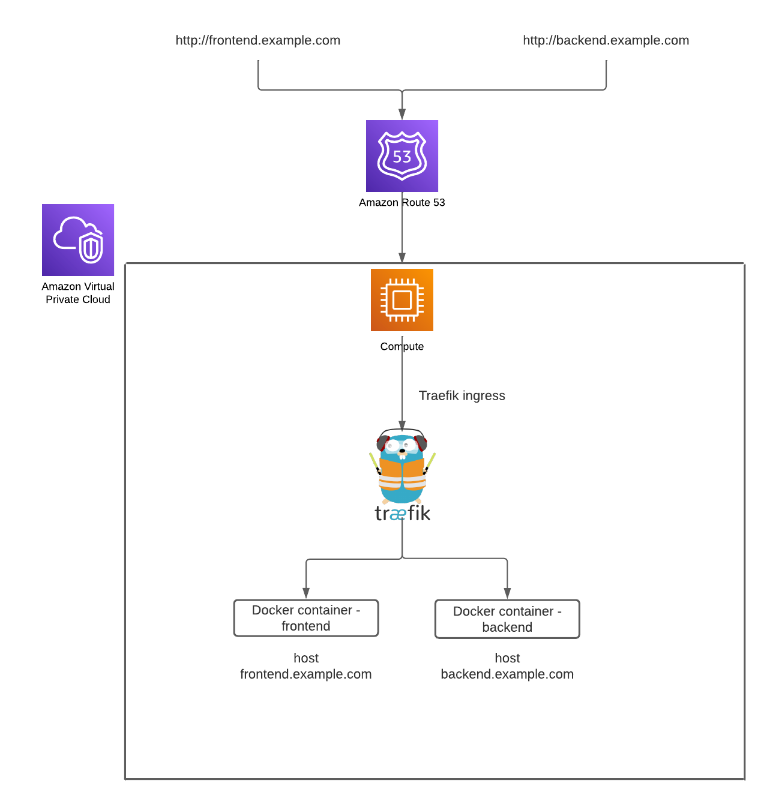

## Tutorial

### Crear un instancia de EC2 para nuestras apps

Lo primero es crear una instancia de EC2 para poder deployar nuestro docker-compose con la configuracion de traefik y nuestras apps (frontend y backend).

Para eso bucamos EC2 en el buscador de la consola de AWS y luego al apartado de instances.

Una vez que estemos en la seccion de las instancias clickearemos el boton que dice “Launch Instances”.

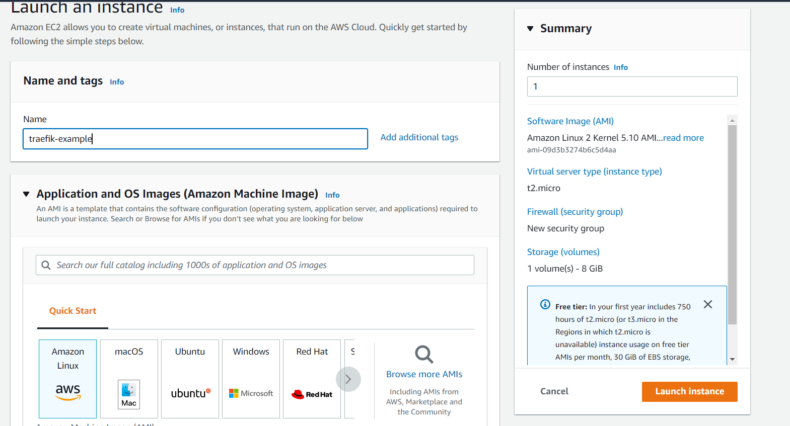

De imagende OS elegiremos Amazon Linux.

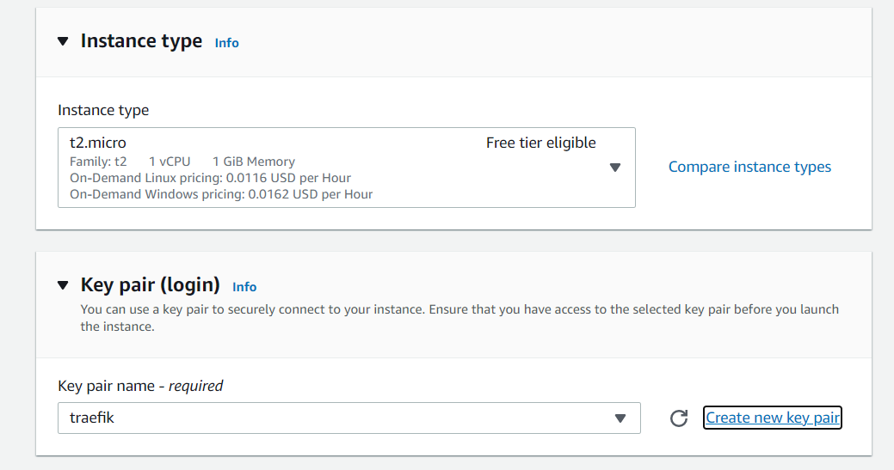

De tipo de instancia elegi la opcion libre (**t2.micro**) y crearemos un key pair para poder conectarnos a la instancia desde nuestra consola con **SSH.**

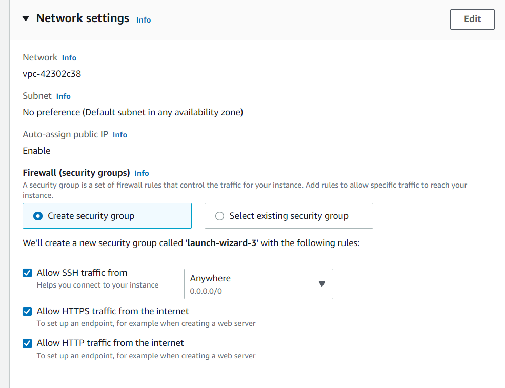

Para las configuraciones de Network crearemos un nuevo Security group que acepte trafico SSH, HTTP y HTTPS. Por ultimo lanzaremos la instancia.

### Instalar Docker y Docker compose en la instancia

Para instalar Docker y Docker compose debemos conectarnos a la instancia desde nuestra consola. Para eso necesitaremos el archivo .pem descargado en el paso anterior.

```bash
ldamore@Desktop:~ $ ssh -i /path/key-pair-name.pem instance-user-name@instance-public-dns-name
```

El instance-user-name es ec2-user y el instance-public-dns-name lo podemos copiar en el detalle de nuestra instancia (Public IPv4 DNS).

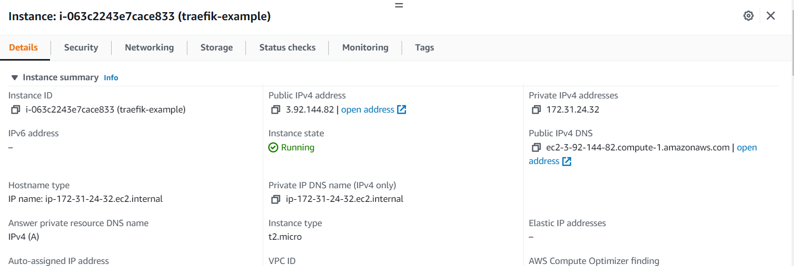

En mi caso seria:

```bash
ldamore@Desktop:~ $ ssh -i traefik.pem ec2-user@ec2-3-92-144-82.compute-1.amazonaws.com
```

Si todo esta bien veremos algo como esto

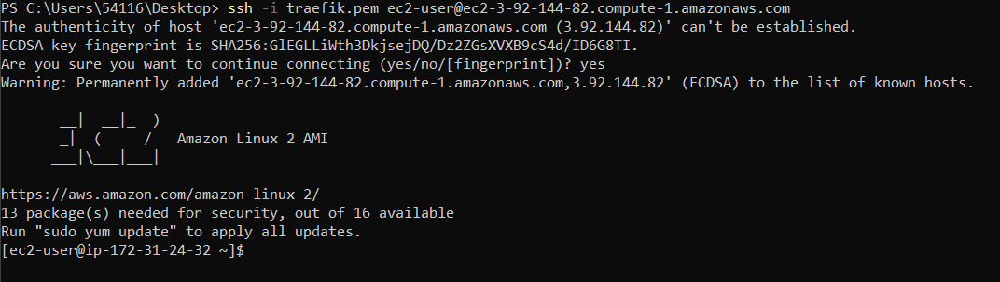

Una vez dentro de la consola podremos instala docker y docker-compose.

Para instalar docker debemos ejecutar los siguientes comandos

1. `sudo yum update -y`
2. `sudo amazon-linux-extras install docker`
3. `sudo service docker start`
4. `sudo systemctl enable docker`
5. `sudo usermod -a -G docker ec2-user`

Una vez hecho esto tenemos que hacer logout y volver a conectarnos a la instancia para refrescar la session y que reconozca que tenemos permisos para ejecutar docker.

Si ejecutamos `docker info` nos deberia salir la informacion de docker.

Para instalar docker-compose debemos ejecutar los siguientes comando

1. `sudo curl -L [https://github.com/docker/compose/releases/download/1.22.0/docker-compose-$](https://github.com/docker/compose/releases/download/1.22.0/docker-compose-$)(uname -s)-$(uname -m) -o /usr/local/bin/docker-compose`
2. `sudo chmod +x /usr/local/bin/docker-compose`
3. `docker-compose version`

### Crear un repositorio para nuestro backend y frontend

Para poder tomar las imagenes de nuestro backend y frontend desde nuestra instancia de EC2, debemos subirlas a un registry. En este caso estaremos usando el registry de Github y buildeando las imagenes con Github Actions.

Recomiendo tomar de guia el repo de este tutorial https://github.com/ldamoredev/traefik-example.

Para crear un nuevo repositorio ejecutaremos los siguientes comandos.

```bash
ldamore@Desktop:~ $ mkdir traefik-example
ldamore@Desktop:~ $ cd traefik-example
ldamore@Desktop/traefik-example:~ $ echo "# traefik-example" >> README.md
ldamore@Desktop/traefik-example:~ $ git init
ldamore@Desktop/traefik-example:~ $ git add README.md
ldamore@Desktop/traefik-example:~ $ git commit -m "first commit"
ldamore@Desktop/traefik-example:~ $ git branch -M main
ldamore@Desktop/traefik-example:~ $ git remote add origin [your-origin]
ldamore@Desktop/traefik-example:~ $ git push -u origin main
```

### Crear un backend y frontend dockerizados

En mi caso creare un backend con Kotlin y un frontend con NextJS. Pueden copiar el codigo del [repositorio](https://github.com/ldamoredev/traefik-example) o elegir crear su propio backend y frontend con el lenguaje que prefieran.

Para el backend con Kotlin el Dockerfile sera el siguiente

```docker
FROM gradle:7.2.0-jdk16 as builder

USER root
ARG COMMIT_SHA

ADD . .

RUN printf %s ".${COMMIT_SHA}" >> VERSION

RUN gradle --parallel --build-cache -Dorg.gradle.console=plain -Dorg.gradle.daemon=false :shadowJar

###########################################################################
FROM openjdk:16-alpine

ENV PORT 6060

WORKDIR /app

COPY --from=builder /home/gradle/build/libs/backend_api.jar backend_api.jar

EXPOSE $PORT

CMD java -Xms256m -Xmx256m -Xss512k -jar backend_api.jar
```

Para el frontend en NextJS el Dockerfile sera el siguiente

```docker
# Install dependencies only when needed
FROM node:16-alpine AS deps
# Check https://github.com/nodejs/docker-node/tree/b4117f9333da4138b03a546ec926ef50a31506c3#nodealpine to understand why libc6-compat might be needed.
RUN apk add --no-cache libc6-compat
WORKDIR /app

# Install dependencies based on the preferred package manager
COPY package.json yarn.lock* package-lock.json* pnpm-lock.yaml* ./
RUN \
  if [ -f yarn.lock ]; then yarn --frozen-lockfile; \
  elif [ -f package-lock.json ]; then npm ci; \
  elif [ -f pnpm-lock.yaml ]; then yarn global add pnpm && pnpm i; \
  else echo "Lockfile not found." && exit 1; \
  fi

# Rebuild the source code only when needed
FROM node:16-alpine AS builder
WORKDIR /app
COPY --from=deps /app/node_modules ./node_modules
COPY . .

# Next.js collects completely anonymous telemetry data about general usage.
# Learn more here: https://nextjs.org/telemetry
# Uncomment the following line in case you want to disable telemetry during the build.
# ENV NEXT_TELEMETRY_DISABLED 1

RUN yarn build

# If using npm comment out above and use below instead
# RUN npm run build

# Production image, copy all the files and run next
FROM node:16-alpine AS runner
WORKDIR /app

ENV NODE_ENV production
# Uncomment the following line in case you want to disable telemetry during runtime.
# ENV NEXT_TELEMETRY_DISABLED 1

RUN addgroup --system --gid 1001 nodejs
RUN adduser --system --uid 1001 nextjs

# You only need to copy next.config.js if you are NOT using the default configuration
# COPY --from=builder /app/next.config.js ./
COPY --from=builder /app/public ./public
COPY --from=builder /app/package.json ./package.json

# Automatically leverage output traces to reduce image size
# https://nextjs.org/docs/advanced-features/output-file-tracing
COPY --from=builder --chown=nextjs:nodejs /app/.next/standalone ./
COPY --from=builder --chown=nextjs:nodejs /app/.next/static ./.next/static

USER nextjs

EXPOSE 3000

ENV PORT 3000

CMD ["node", "server.js"]
```

### Buildear las imagenes de nuestras apps backend y frontend y pushearlas al registry de github

Para poder tomar las imagenes de nuestro backend y frontend desde la instancia de EC2 necesitamos descargarlas de un registry donde las hayamos pusheado. En este caso estaremos utilizando el registry de Github y pushearemos las imagenes con Github Actions.

Dentro de nuestro proyecto crearemos una carpeta llamada `.github`, otra adentro de ella llamada `workflows` y un archivo adentro llamado `pipeline.yml`

Dentro de `.github/workflows/pipeline.yml`

```yaml
on:
  push:
    branches:
      - main

env:
  GITHUB_REGISTRY: ghcr.io
  GITHUB_REGISTRY_USER: ${{ github.actor }}
  GITHUB_REGISTRY_PASSWORD: ${{ secrets.GITHUB_TOKEN }}
  GITHUB_SHA: ${{ github.sha }}

jobs:
  backend-build:
    runs-on: ubuntu-latest
    steps:
      - name: Checkout repository
        uses: actions/checkout@v2
      - name: Push backend image
        run: |
          cd backend
          docker login -u $GITHUB_REGISTRY_USER -p $GITHUB_REGISTRY_PASSWORD $GITHUB_REGISTRY
          docker build --tag $GITHUB_REGISTRY/$GITHUB_REPOSITORY/backend:latest --build-arg COMMIT_SHA=${GITHUB_SHA} .
          docker push $GITHUB_REGISTRY/$GITHUB_REPOSITORY/backend:latest
  frontend-build:
    runs-on: ubuntu-latest
    steps:
      - name: Checkout repository
        uses: actions/checkout@v2
      - name: Push frontend image
        run: |
          cd frontend
          docker login -u $GITHUB_REGISTRY_USER -p $GITHUB_REGISTRY_PASSWORD $GITHUB_REGISTRY
          docker build --tag $GITHUB_REGISTRY/$GITHUB_REPOSITORY/frontend:latest .
          docker push $GITHUB_REGISTRY/$GITHUB_REPOSITORY/frontend:latest
```

Este archivo se ejecutara cada vez que pusheamos una nueva version de nuestro codigo. Su funcion es conectarse al registry de github, buildear la imagen del backend y frontend y pushearlas al registry de github.

Una vez ejecutado el pipeline podemos ver que en nuestro repositorio tendremos 2 paquetes.

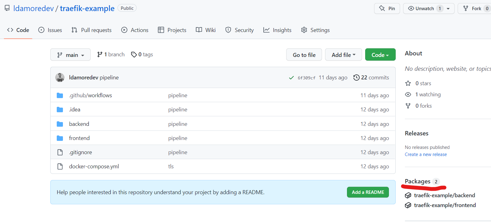

Eso nos indicara que las imagenes ya estan guardadas en el registry de github.

### Crear nuestro archivo docker compose y subirlo a la instancia de EC2

Una vez alamacenadas las imagenes en el registry, podemos subir nuestro docker-compose con la configuracion de traefik y los servicios de nuestras apps (en este caso el backend y el frontend).

```yaml
version: "3"

networks:
  traefik-net:
    external: true

services:
  traefik-ingress:
    image: traefik:v2.3.5
    command:
      - "--providers.docker=true"
      - "--providers.docker.exposedbydefault=false"
      - "--entrypoints.web.address=:80"
      - "--entrypoints.websecure.address=:443"
      - "--certificatesresolvers.myresolver.acme.tlschallenge=true"
      - "--certificatesresolvers.myresolver.acme.email=lautidamore@gmail.com"
      - "--certificatesresolvers.myresolver.acme.storage=/letsencrypt/acme.json"
    ports:
      - 80:80
      - 443:443
      - 8080:8080
    volumes:
      - ./letsencrypt:/letsencrypt
      - /var/run/docker.sock:/var/run/docker.sock:ro
    networks:
      - traefik-net

  frontend:
    image: ghcr.io/ldamoredev/traefik-example/frontend:latest
    labels:
      - traefik.enable=true
      - traefik.http.routers.frontend.rule=Host(`frontend.ldamore.com`)
      - traefik.port=3000
      - traefik.http.routers.frontend.entrypoints=websecure
      - traefik.http.routers.frontend.tls.certresolver=myresolver
    networks:
      - traefik-net

  backend:
    image: ghcr.io/ldamoredev/traefik-example/backend:latest
    labels:
      - traefik.enable=true
      - traefik.http.routers.backend.rule=Host(`backend.ldamore.com`)
      - traefik.port=6060
      - traefik.http.routers.backend.entrypoints=websecure
      - traefik.http.routers.backend.tls.certresolver=myresolver
    networks:
      - traefik-net
```

1. Lo primero que crearemos es una network external para que se pueda acceder a nuestros servicios.
2. Lo que sigue es la configuracion de traefik, en este caso la configuracion indica que aceptamos peticiones HTTP por el puerto 80 y peticiones HTTPS por el puerto 443. Para configurar TLS lo haremos con letsencrypt, pero traefik se encargara de la configuracion y la renovacion del TLS por nosotros.
3. Luego tenemos el servicio frontend y backend, que apunta a la imagenes subidas al registry de github. Ademas tiene labels que traefik reconoce para que cuando se acceda a la instancia de EC2 mediante el DNS “frontend.ldamore.com” traefik redirija esa peticion al servicio de fronend y cuando se acceda a “backend.ldamore.com” traefik lo redirija al backend.

Para subir el archivo a la instancia de EC2 debemos seguir los siguientes pasos:

1. Conectarse a la instancia EC2 mediante SSH como en los pasos anteriores.
2. Una vez conectados a la instancia EC2 crearemos un archivo docker-compose.yml. Para eso ejecutaremos el comando `touch docker-compose.yml`
3. Para poder editar el archivo y pegar el contenido de nuestro archivo docker compose ejecutaremos el comando `vi docker-compose.yml`
4. Una vez copiado el contenido del archivo, debemos logearnos al registry de github para pullear las imagenes y le vantar el servicio. Para eso debemos crear un [personal access token](https://docs.github.com/en/packages/working-with-a-github-packages-registry/working-with-the-container-registry#authenticating-to-the-container-registry).
5. Generado el token, podemos hacer login al registry de github con el siguiente comando
`docker login -u your_github_username -p your_github_access_token [ghcr.io](http://ghcr.io/)`
6. Si el login fue correcto podemos pullear las imagenes con `docker-compose pull`
7. Y arrancar el servicio con `docker-compose up -d`

Nuestros servicios ya estaran corriendo pero aun no podemos acceder a ellos ya que traefik solo aceptara y redirija trafico que venga del dominio frontend.ldamore.com o backend.ldamore.com (en mi caso esos fueron los dominios que configure en traefik)

### Crear una ip publica estatica en Elastic IP para nuestra instancia de EC2

Debido a que la ip publica de nuestra instancia puede cambiar, necesitamos asignarle una ip publica estatica para que esta no cambie. Asi, cuando en nuestro DNS configuremos para que los nombres de dominio apunten a esa ip, esta sera siempre la misma.

Para crear una ip publica estatica debemos seguir los siguientes pasos:

1. Buscar EC2 en la consola de amazon e ir al **Dashboard de EC2**.
2. Ir a la seccion **Elastic IPs**
3. Clickear el boton Allocate Elastic IP Address
4. Crear la Elastic IP address con la configuracion por default

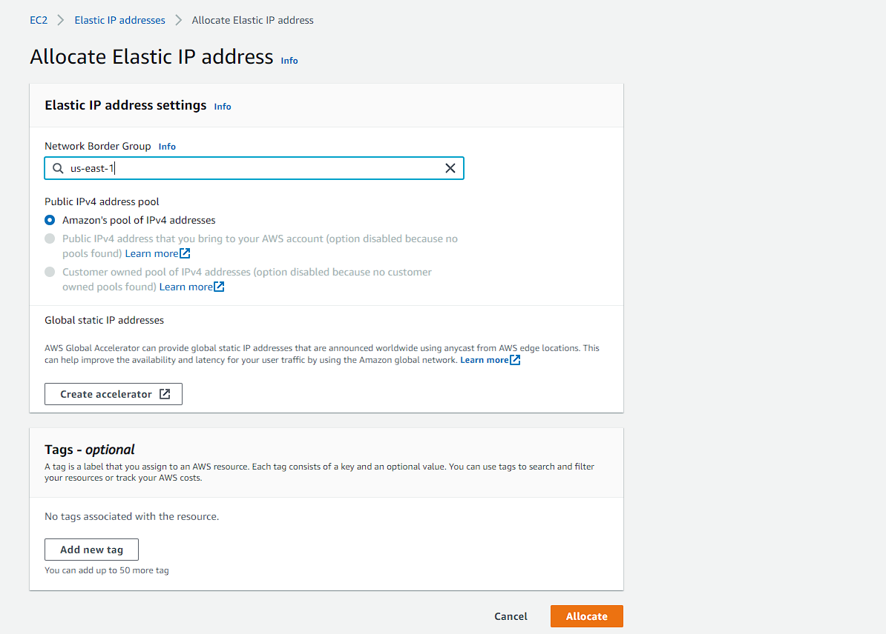

1. Luego en el listado de nuestras Elastic IP addresses debemos seleccionar la recien creada, ir a **Actions** y seleccionar “**Associate Elastic IP address**” y seleccionar la instancia de EC2.

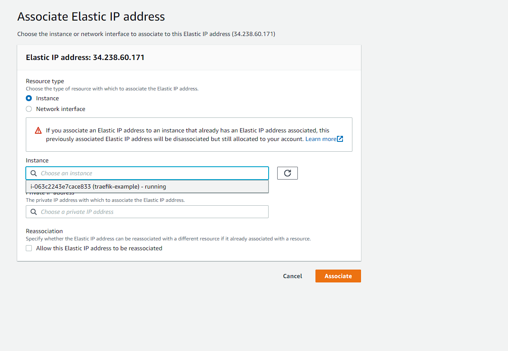

Una vez hecho esto podemos ver en nuestra instancia EC2 que nos informara que tenemos una Elastic IP address asociada.

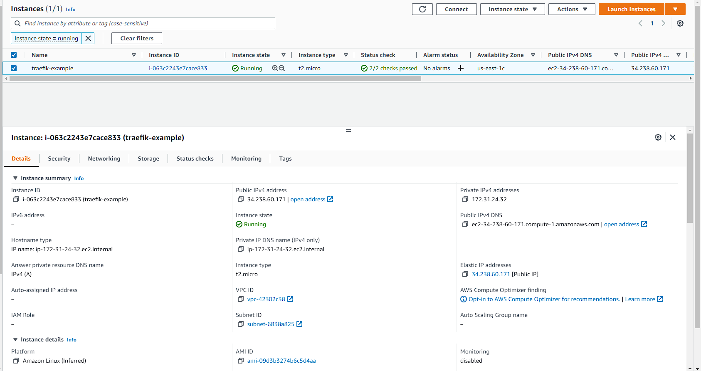

Es imporante aclarar que una vez que hayamos asociado nuestra Elastic IP address a EC2, nuestro **Public IPv4 DNS** cambiara, por lo que habra que tomar este nuevo nombre de DNS para conectarse por SSH a nuestra instancia.

### Configurar nuestro DNS para que apunte a la instancia de EC2

Para configurar nuestro DNS debemos ir a nuestro proveedor de DNS y apuntar a la IP de nuestra instancia de EC2. En mi caso estare usando Route 53 de amazon.

Dentro de nuestros dominios registrados, crearemos un nuevo record para cada aplicacion (frontend y backend). En mi caso configurare los subdominios [backend.ldamore.com](http://backend.ldamore.com) y frontend.ldamore.com.

Lo importante aca es seleccionar el **Record type** en “**A**” y de value poner la Elastic IP address asociada a la instancia de EC2.

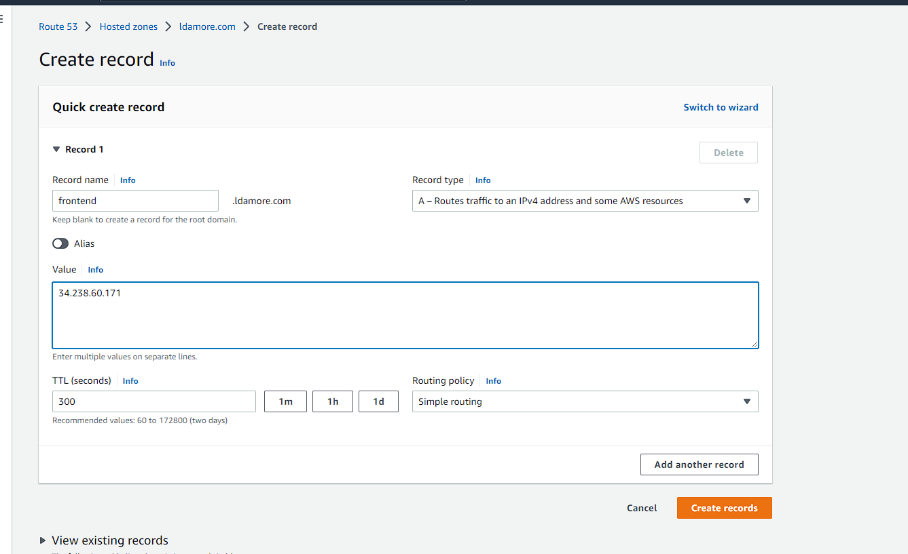

Luego de unos minutos cuando las caches de los DNS se invaliden, podemos entrar a nuestros sitios mediante los nombres que configuramos.

Es importante destacar que el certificado para tener HTTPS a veces tarda en validarse, por lo que si entramos a nuestra aplicacion y vemos que nos dice que no es seguro, solo tenemos que esperar a que se valide.

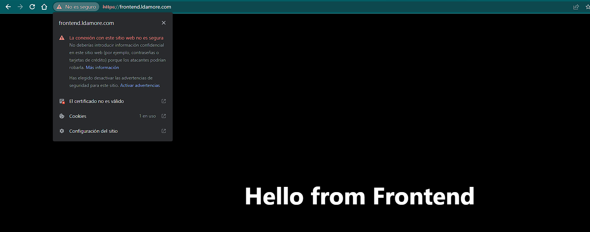

### Automarizar deploys con GitHub Actions

Lo ultimo que nos queda seria automatizar el deploy, esto quiere decir que estaremos automatizando los siguientes pasos.

1. Conectarse a la instancia EC2 por SSH
2. Pullear las nuevas imagenes de nuestro frontend y backend
3. Restartear el servicio

Para eso agregaremos un paso mas a nuestro pipeline en `.github/workflows/pipeline.yml`

```yaml
deploy:
    runs-on: ubuntu-latest
    needs: [ frontend-build, backend-build ]
    env:
      PRIVATE_KEY: ${{ secrets.AWS_PRIVATE_KEY  }}
      HOSTNAME: ${{ secrets.HOSTNAME  }}
      USER_NAME: ${{ secrets.USER_NAME  }}
      GITHUB_REGISTRY: ghcr.io
      GITHUB_REGISTRY_USER: ${{ github.actor }}
      GITHUB_REGISTRY_PASSWORD: ${{ secrets.GITHUB_TOKEN }}
      ACCESS_TOKEN: ${{ secrets.ACCESS_TOKEN }}
    steps:
      - name: Checkout repository
        uses: actions/checkout@v2
      - name: Deploy to EC2 via SSH action
        uses: garygrossgarten/github-action-ssh@release
        with:
          host: ${{ secrets.HOSTNAME }}
          username: ${{ secrets.USER_NAME }}
          privateKey: ${{ secrets.AWS_PRIVATE_KEY }}
          command: |
            docker login -u ldamoredev -p ${{ secrets.ACCESS_TOKEN }} ghcr.io
            docker-compose pull
            docker-compose up -d
```
