## Contenido

- Introducción
- Crear una instancia EC2 en AWS
- Conectarse a la instancia
- Instalar Vault en la instancia
- Configurar el servidor de Vault
- Inicializar Vault
- Configurar DNS para un Custom Domain
- Activar SSL/TLS con Certbot y letsencrypt

### Introduccion

Vault es un sistema de manejo de secretos. Un secreto es cualquier cosa que necesitamos tener acceso de control, como puede ser API keys, passwords y certificados. Vault nos provee un sistema con manejo de identidad y reglas para decidir quien accede a los secretos.

Ademas Vault encripta los secretos por nosotros y los usarios son los unicos que tienen llaves para desencriptarlos.

### Crear una instancia EC2 en AWS

Lo primero es crear un instancia de EC2 para que pueda servir nuestra UI de Vault.  Para eso debemos ir al dashboard de EC2 y lanzar una nueva instancia.

Ponemos un nombre y en mi caso elegi Amazon Linux como sistema operativo. En el caso del tipo de instancia elegi la opcion gratuita (**t2.micro**).


En la seccion de Key pair, cree una nueva key para conectarse mediante SSH a la instancia de EC2.

<aside>
💡 Es importante guardar este archivo porque es con el que nos vamos a poder conectar a la instancia de EC2.

</aside>

Luego en la configuracion de Network creamos un nuevo security group habilitando el trafico SSH.

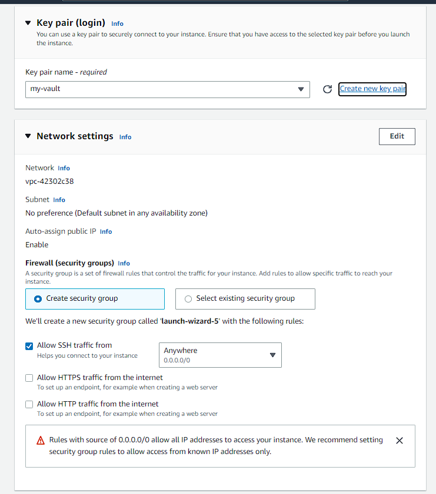

Una vez todo configurado apretamos en **Launch Instance**

### Conectarse a la instancia

Para conectarnos a la instancia debemos ejecutar el siguiente comando:

- Remplazando `path-key-pair.pem` por el path de donde tengamos guardado el archivo con la key
- Remplazando `instance-public-dns-name` el dominio por el que es sale en la instancia. (En el dashboard de EC2, dentro del detalle de nuestra instancia, tendremos nuestro dominio en la seccion de `Public IPv4 DNS`)

```bash
ldamore@Desktop:~ $ ssh -i path-key-pair.pem ec2-user@instance-public-dns-name
```


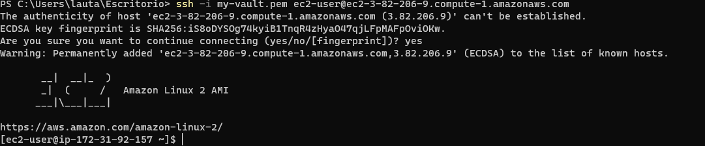

### Instalar Vault en la instancia

Una vez dentro de la instancia debemos correr los siguientes comomandos para intalar Vault

- Instalar `yum-config-manager`

```bash
ec2-user@ip-172-31-92-157:~ $ sudo yum install -y yum-utils
```

- Usar `yum-config-manager` para agregar el repositorio oficial de HashiCorp Linux

```bash
ec2-user@ip-172-31-92-157:~ $ sudo yum-config-manager --add-repo https://rpm.releases.hashicorp.com/AmazonLinux/hashicorp.repo
```

- Instalar Vault

```bash
ec2-user@ip-172-31-92-157:~ $ sudo yum -y install vault
```

Para verificar que Vault se ha instalado correctamente podemos correr el comando `Vault` y deberiamos ver algo parecido a esto

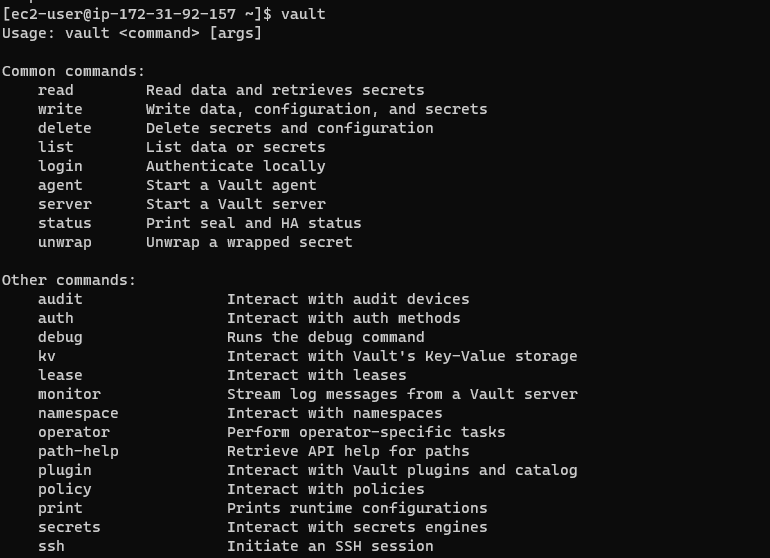

### Configurar el servidor de Vault

Una vez que ya tenemos vault levantado debemos configurarlo para indicarle donde debe guardar los secretos, si va a tener la UI habilitada, que ip y puerto va escuchar el servidor, etc.

Para eso debemos crear un archivo llamado `config.hcl`

```bash
ec2-user@ip-172-31-92-157:~ $ touch config.hcl
```

Y copiar la siguiente configuracion dentro del archivo

```
ui = true
disable_mlock = true

storage "raft" {
  path = "./vault/data"
  node_id = "node1"
}

listener "tcp" {
  address = "your-private-ip-address:8200"
  tls_disable = "true"
}

api_addr = "http://your-private-ip-address:8200"
cluster_addr = "http://your-private-ip-address:8201"
```

El storage es donde Vault guardara nuestra informacion. Podemos elegir distintos tipos de storage (un bucket de S3, una base de datos, etc). En este caso decidimos guardarlo en archivos encriptados dentro del servidor

Tambien tenemos el listener que va a estar escuchando peticiones. Por ahora dejamos el tls desactivado (mas tarde lo configuraremos).

Y dentro de cada address debemos poner la ip privada de la instancia que la encotraremos, en el detalle de nuestra instancia, dentro de la seccion **Private IPv4 addresses.**

Luego debemos crear la carpeta donde se guardaran los datos encriptados. Ademas debemos exponer una variable de entorno para indicarle a Vault su ip. Poniendo la ip privada de nuestra instancia.

```bash
ec2-user@ip-172-31-92-157:~ $ mkdir -p ./vault/data
ec2-user@ip-172-31-92-157:~ $ export VAULT_ADDR='http://your-private-ip-address:8200'
```

Ahora si podemos correr nuestro servidor de vault ejecutando el siguiente comando

```bash
ec2-user@ip-172-31-92-157:~ $ vault server -config=config.hcl
```

Y deberiamos ver algo parecido a esto

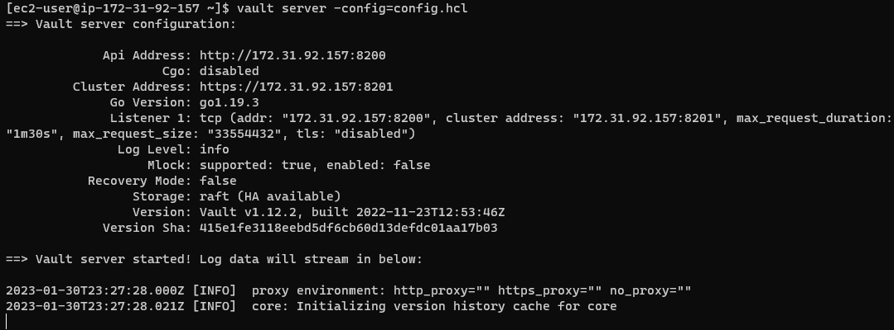

Antes de probar si nuestro servidor de Vault esta funcionando correctamente, debemos indicarle a la instancia de EC2 que acepte recibir peticiones TCP en el puerto 8200 (que es donde estara escuchando el servidor de Vault)

Para eso debemos ir al apartedo de security en nuestra instancia, y darle click al enlace de security groups.

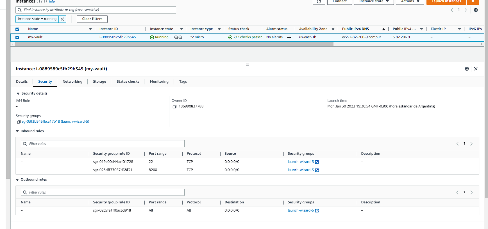

Dentro de nuestro security group debemos agregar una nueva regla de Inbound

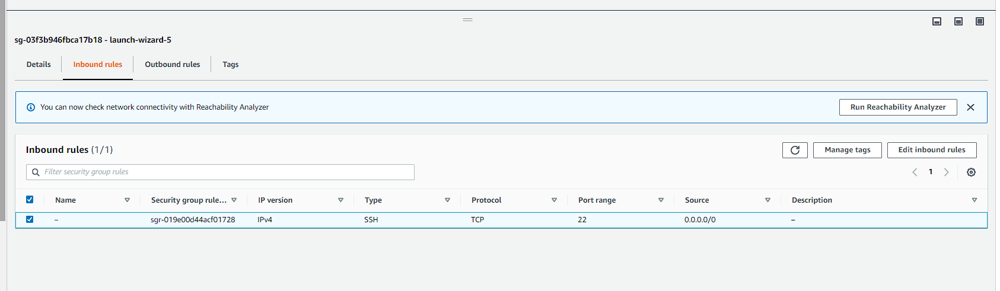

Con la siguiente configuracion

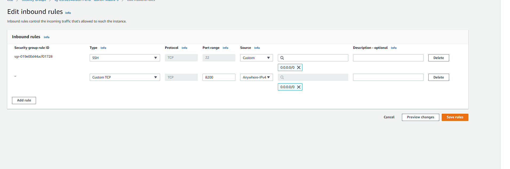

Una vez creada la regla, podemos verificar que nuestro servidor de Vault aceptando peticiones entrando a la IP publica o al DNS publico de la instancia en el puerto 8200

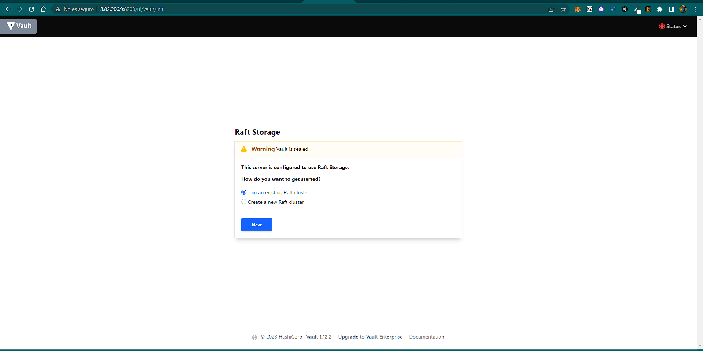

Si inspeccionamos el estado de Vault veremos que esta **Sealed**

### Inicializar Vault

Cuando se inicia un servidor de Vault, se inicia en un estado **Sealed**. En este estado, Vault está configurado para saber dónde y cómo acceder al almacenamiento físico, pero no sabe cómo desencriptarlo.

El preoceso **Unsealing** es el proceso de obtener la root key para desencriptar datos, lo que permite el acceso a Vault.

Para lograr el estado **Unsealed**

Para cambiar el estado de Vault a **Unsealed** debemos correr el siguiente comiando.

```bash
ec2-user@ip-172-31-92-157:~ $ vault operator init
```

<aside>
💡 Para que este comando funcion el servidor de vault tiene que estar levantado con el comando `vault server -config=config.hcl` y la variable de entorno VAULT_ADDR inicializada `export VAULT_ADDR='http://your-private-ip-address:8200'`

</aside>

Tendremos un resultado como el siguiente. Es importante guardar al menos **3 de las Unseal Keys** y el **Root Token** ya que Vault es la unica vez que nos mostrara esta informacion.

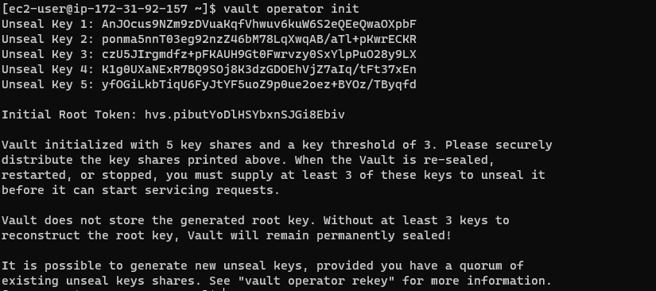

Para cambiar el estado a **Unsealed** debemos proporcionar 3 de las llaves que guardamos.

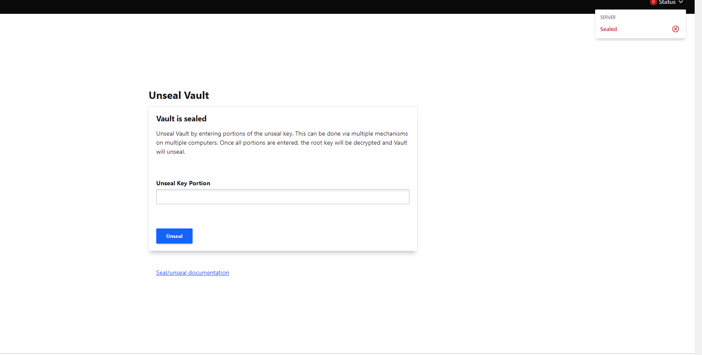

Y una vez proporcionadas podemos entrar a Vault con nuestro **Root Token**

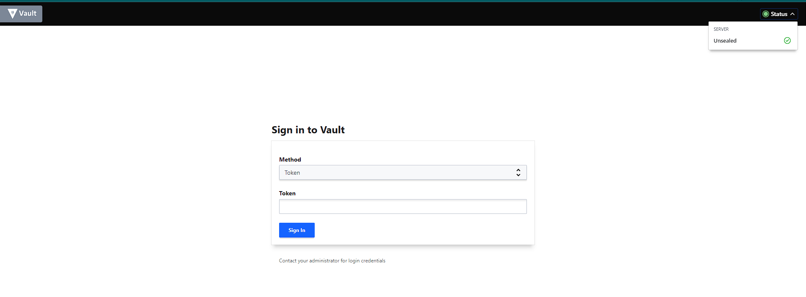

### Configurar DNS para un Custom Domain

Para configurar nuestro propio dominio primero debemos asigar una IP estatica a nuestra instancia de EC2 (para que esta no cambie si la instancia muere)

Para eso vamos al Dashboard de EC2  y vamos al apartado de Elastic IP Address para poder asignar una nueva **Elastic IP address**

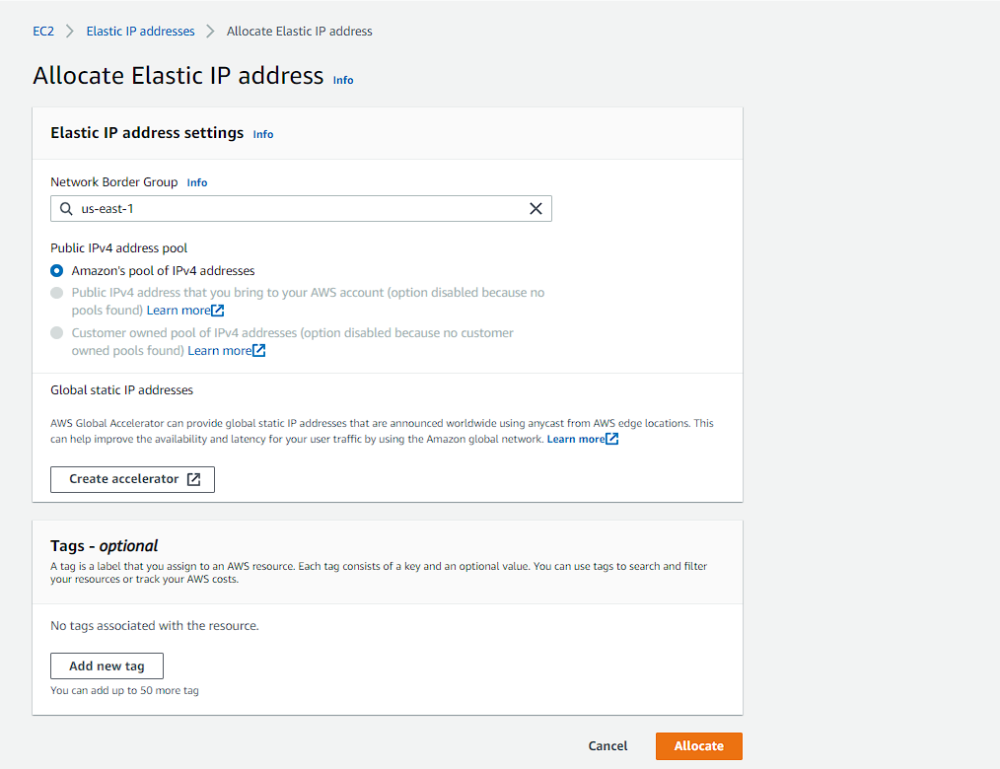

Una vez creada nuestra Elastic IP address, debemos volver al Dashboard y seleccionandola tocamos el voton de Actions y le damos a Associate Elastic IP address. Donde debemos elegir nuestra instancia con Vault corriendo

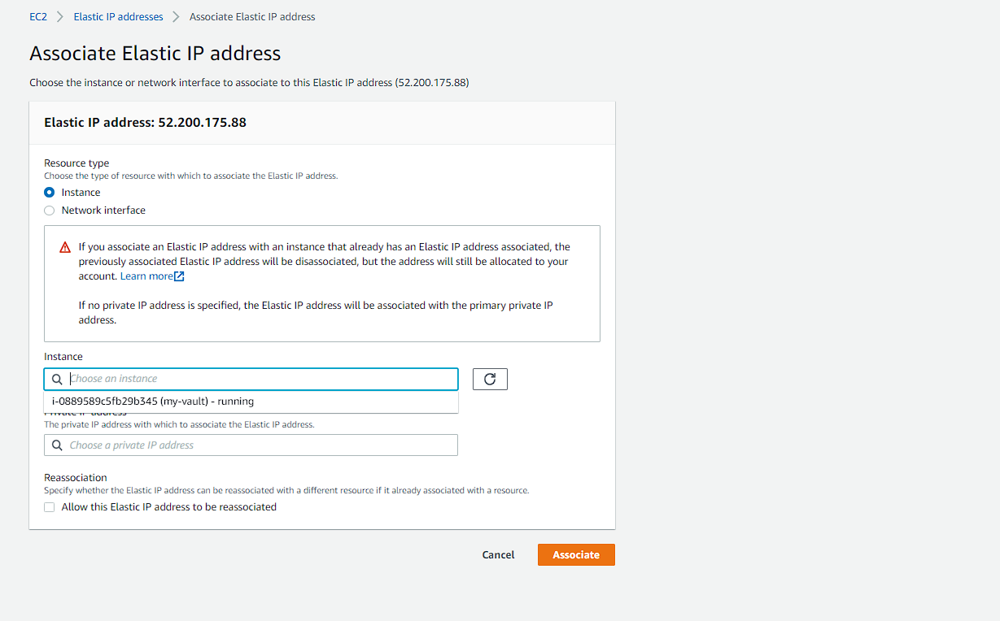

<aside>
💡 Recordemos que una vez hecho esto, si estabamos conectados a nuestra instancia por SSH nos cortara la conexion porque la IP publica de la instancia cambio. Para conectarnos nuevamente debemos ir al detalle de nuestra instancia y copiar la nueva IP publica o la IP DNS publica

</aside>

Una vez que tenemos la nueva IP publica, debemos ir a nuestro proveedor de DNS para configurar el nuevo dominio. En mi caso estoy usando Route 53 de AWS. Pero lo importante es crear un nuevo record en nuestro proveedor de DNS con:

- El nuevo nombre de dominio
- El record type: A
- Y el value con la nueva **IP publica**

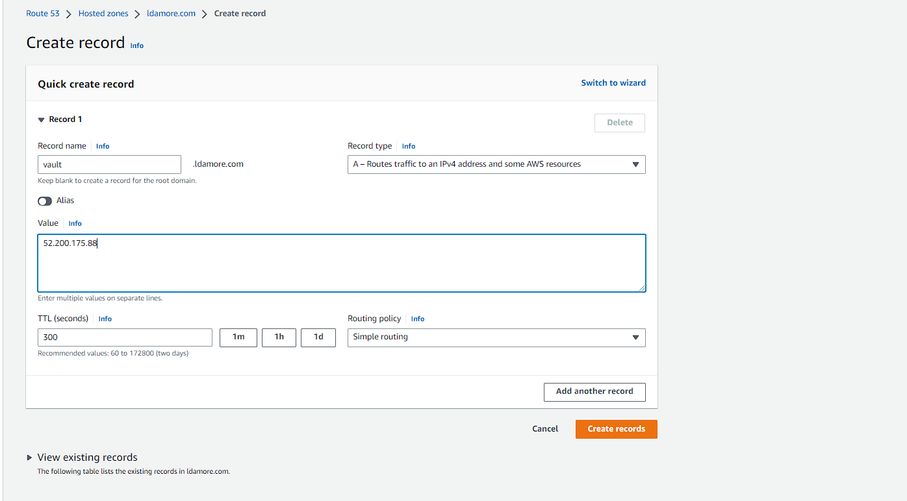

Una vez propagado el nuevo dominio (tarda unos minutos), podemos acceder a nuestro servidor de Vault con el nuevo custom domain

### Activar SSL/TLS con Certbot y letsencrypt

Para activar SSL/TLS en nuestro server debemos instalar Certbot y generar certificados para nuestro servidor. Ademas debemos ir a nuestro proveedor de DNS y agregar el record correspondiente.

Para instalar Certbot debemos correr los siguiente comandos:

```bash
ec2-user@ip-172-31-92-157:~ $ sudo yum install -y https://dl.fedoraproject.org/pub/epel/epel-release-latest-7.noarch.rpm
ec2-user@ip-172-31-92-157:~ $ sudo yum install certbot
```

Para generar el certificado debemos ejecutar el siguiente comando:

```bash
ec2-user@ip-172-31-92-157:~ $ sudo certbot certonly --manual --preferred-challenges=dns --email lautarolioneldamore@gmail.com --agree-tos -d vault.ldamore.com
```

Una vez ejecutado nos dara los record para añadir en nuesto proveedor de DNS

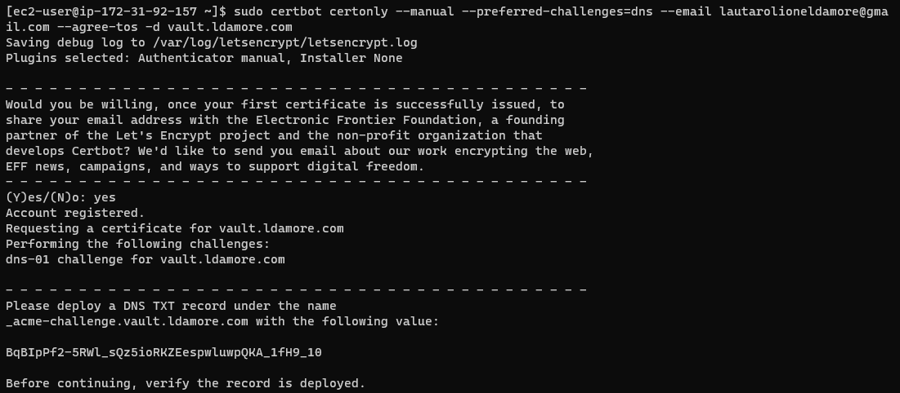

Una vez creado los records, apretamos enter y nos indicara la ubicacion de el certificado y la private key.

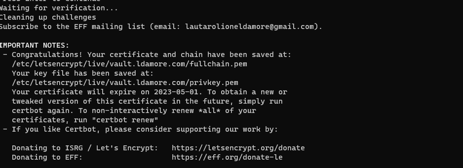

Lo que falta hora es indicarle al servidor de Vault donde estan los certificados para poder habilitar SSL/TLS

```
ui = true
disable_mlock = true

storage "raft" {
  path = "./vault/data"
  node_id = "node1"
}

listener "tcp" {
  address = "your-private-ip-address:8200"
  tls_disable = "false"
  tls_cert_file = "cert.pem"
  tls_key_file = "privkey.pem"
}

api_addr = "https://your-private-ip-address:8200"
cluster_addr = "https://your-private-ip-address:8201"
```

Ahora debemos reiniciar el servidor con la nueva configuracion (si vault esta levantado debemos matar el proceso con `pkill`)

```bash
ec2-user@ip-172-31-92-157:~ $ pkill -e vault
ec2-user@ip-172-31-92-157:~ $ export VAULT_ADDR='[https://172.31.92.157:8200](https://172.31.92.157:8200/)'
ec2-user@ip-172-31-92-157:~ $ vault server -config=config.hcl
```
