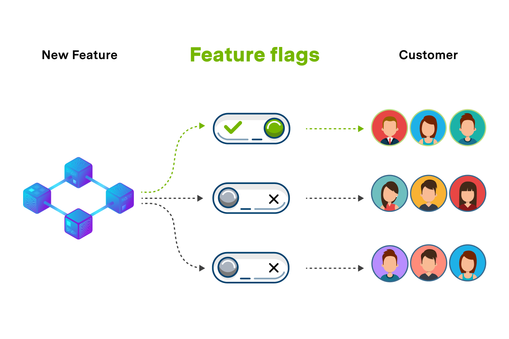

Los feature flags son una tecnica que nos permite modificar el comportamiento del sistema sin modificar el codigo. Nos permite prender y apagar funcionalidades sin la necesidad de codear. Sin embargo feature flags agrega complejidad, por lo que se recomienda limitar el uso de feature flags.



### Un ejemplo

Imaginemos que nuestro jefe nos dice que el gobierno exigio cambiar la forma en que se calculan los impuestos en una venta. La nueva forma es compleja y requiere quizas varios dias de desarrollo. Pero nuestro equipo es agil y no quiere dejar de hacer entrega continua y parar los deploys hasta que este el nuevo algoritmo.

Aca entran los feature flags:

```jsx
function calculateTaxes(sale){
	if(featureIsEnabled("use-new-taxes-algorithm")){
		return sale.calculateTaxes(sale);
	}else{
		return sale.oldcalculateTaxes(sale);
	}
}
```

El equipo decidio renombrar al viejo algoritmo calculateTaxes por oldCalculateTaxes, entonces dependiendo el valor de `use-new-taxes-algorithm` el equipo podia probar el nuevo algoritmo o dejar el viejo algoritmo activando/desactivando el feature.

### Categorias de feature flags

Feature flgas pueden ser categrizados a traves de dos grandes caracteristicas: cuanto va a vivir el feature y que tan dinamico va a ser.

**Release Flags**
Son aquellos features que activan ciertas funcionalidades y que permiten a los equipos hacer entrega continua (caso ejemplo anterior). No solo podemos activar o desactivar funcionalidades logicas sino que tambien visuales.
**Duracion**: dias o semanas
**Dinamismo**: por deployment o runtime

**Experiment Flags**
Generalmente son usados para hacer A/B testing. Se usa generalmente parar probar estadisticamente funcionalidades.
**Duracion**: dias o semanas
**DInamismo**: por request

**Ops Flags**
Se utilizan para controlar aspectos operativos del sistema. Vamos a poner un ejemplo supongamos que tenemos una carga imprevista muy pesada en nuestra pagina culpa del sistema de recomendacion de la home que aun no esta muy optimizado. Podemos poner un Ops feature flag para apagar el sistema de recomendacion para que no tarde tanto en cargar la pagina.
**Duracion**: meses o años
**Dinamismo**: runtime

<aside>
💡  Los feature flags que son cambiados por deployment se le suelen decir feature flags **estaticos**. Y a los que cambian en runtime o por request **dinamicos**

</aside>

### Configuracion de feature flags

Hay diferentes maneras de manejar la configuracion de un feature file. Dependiendo el dinamismo que le querramos dar a los feature flags. Se recomienda en el caso de que la naturaleza del feature flga lo permita, elegir una configuracion estatica. Ya que de esta manera sabemos siempre como se va comportar el sistema.

- **Harcoded Feature flag**: Tecnica basica que se puede utilizar comentando y descomentado codigo. Si queremos usar una funcionalidad comentamos la otra y en el proximo deploy si queremos utilizar otra descomentamos la otra

```jsx
deploy 1:
//sale.calculateTaxes()
sale.calculateOldTaxes()
deploy 2:
sale.calculateTaxes()
//sale.calculateOldTaxes()
```

- **Configuration File Feature flag**: Otra opcion es leer la configuracion del feature flag a traves de un archivo. Lo mas comun es usarlo en archivos .env
.env file:

```
USE_NEW_TAXES_ALGORITHM= true
```

- **App DB Feature flag**: Otra opcion muy conocida es tener una db donde se almacenan los datos, un admin desde donde poder cambiar los features y un set de herramientas que te permiten leer esos features flags desde la app. De esta manera se logra el dinimismo en run time.
- **Distributes Feature flag**: Se usa en sistemas distribuidos, permite la configuracion dinamica y notifica automaticamente a todos los nodos del sistema distribuido.
- **Per request Feature flag**: La configuracion es leida a traves de una cookie o header del request http.

### Conclusion

Como vimos los features flags son utiles y baratos de crear. Como dijimos previamente nos premite apagar y prender funcionalidades del sistema. Sin embargo agregan complejidad y tienen un costo de mantenimiento. Por eso hay que verlos como que suman costo al sistema y hay que bajar el inventario a lo mas bajo posible. Recordar eliminar viejos feature flags que no se usan.
