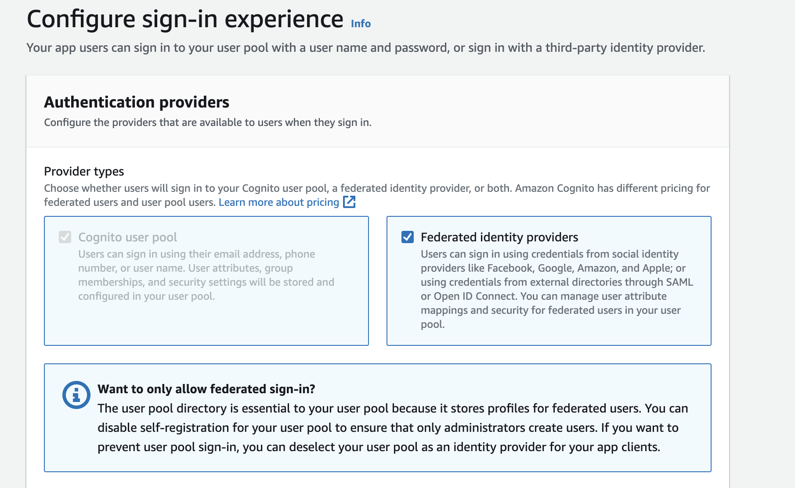

Sin Hosted UI, sin autenticación del lado del cliente con AWS Amplify, solo tu guía directa para implementar un inicio de sesión de forma local con Google utilizando Amazon Cognito y Next.js.
En pocas palabras es un proyecto autonomo sin la ayuda de amplify o SDKs de google.

### Resumen
¿Alguna vez te has preguntado cómo funciona el inicio de sesión con Google? OAuth 2.0, OpenID Connect, tal vez hayas escuchado estos términos mientras intentabas configurar el inicio de sesión social de tu aplicación. Antes de profundizar, aquí tienes un desglose simplificado para ayudarte a entender el proceso:

### 1. Autenticación del usuario y consentimiento:
La aplicación cliente inicia sesión con Google redirigiendo al usuario al servidor de autorización de Google.
El usuario se autentica y otorga permiso a la aplicación cliente para acceder a su cuenta de Google.
### 2. Servidor de autorización de Google::
El servidor de autorización de Google emite un código de autorización al cliente tras la autenticación y el consentimiento exitosos.
### 3. Intercambiar el código de autorización con Cognito::
El cliente toma el código de autorización y lo intercambia con el servidor de autorización de Amazon Cognito (endpoint de token) para obtener los tokens específicos de Cognito.
### 4. Cognito como proveedor OAuth 2.0:
Amazon Cognito valida el código de autorización de Google y emite sus propios tokens, incluidos un token de ID y un token de acceso.
### 5.Acceder a recursos protegidos por Cognito:
El cliente puede usar los tokens obtenidos para acceder a recursos protegidos por Cognito, como servicios de AWS o APIs. Si este resumen rápido no te ha sido de mucha ayuda, lo único que queda por hacer es ensuciarnos las manos.

### Configuración
Antes de implementar el inicio de sesión con Google en tu proyecto, debemos configurar los prerrequisitos necesarios. Las siguientes subsecciones te guiarán en la creación de tu pool de usuarios de Amazon Cognito, el registro de tu aplicación con Google, y la integración de ambos agregando Google como proveedor de identidad social con el pool de usuarios que crearás.

Si ya has hecho estos pasos, puedes saltarte las siguientes secciones y proceder a la parte de Google Sign In.

### Creación de tu pool de usuarios de Amazon Cognito
1. Ingresa a la consoal de AWS y luego busca el servicio de Amazon cognito, elige Crear pool de usuarios.


2. En Configurar experiencia de inicio de sesión, elige Federated identity providers.



3. En las opciones de inicio de sesión del pool de usuarios de Cognito, puedes seleccionar Correo electrónico como mínimo. Luego selecciona Google en las opciones de inicio de sesión federado.


4. En Configurar requisitos de seguridad, puedes dejar las opciones predeterminadas de Cognito marcadas para la política de contraseñas.

5. Para fines de prueba, elige Sin MFA para la autenticación de múltiples factores.


6. Deja la recuperación de la cuenta de usuario como está.

7. En la sección Configurar experiencia de registro, mantén la configuración sin cambios.

8. En Configurar entrega de mensajes, elige Enviar correo electrónico con Cognito para el correo electrónico.

9. Omite Conectar proveedores de identidad federada por ahora.


10. En Integrar tu aplicación, ingresa el nombre deseado para el pool de usuarios y el nombre del dominio de Cognito.


11. Elige Cliente confidencial en Cliente de aplicación inicial, e ingresa un nombre amigable para el cliente de la aplicación. Asegúrate de que la opción Generar un secreto de cliente esté seleccionada.


12.Ingresa http://localhost:3000/api/auth/callback como tu URL en las URLs de retorno permitidas. Deja el resto de la configuración sin cambios.


13. Procede a la sección Revisar y crear y crea tu pool de usuarios


### Registra tu aplicación con Google
1. Ve e inicia sesión en la consola de Google Cloud Platform..

2. Elige Seleccionar un proyecto en la barra de navegación superior y selecciona NUEVO PROYECTO.


3. En la barra de navegación izquierda, elige APIs y Servicios, luego Pantalla de consentimiento de OAuth. Asegúrate de que tu proyecto esté seleccionado.


4. Elige Externo en Tipo de usuario y elige CREAR.


5. Ingresa la información deseada para la aplicación, el logotipo de la aplicación y los detalles del dominio de la aplicación (deja los dominios vacíos).


6. En dominios autorizados, ingresa amazoncognito.com. Introduce tu dirección de correo electrónico deseada para la información de contacto del desarrollador. Luego elige GUARDAR Y CONTINUAR.

7. En Alcances, elige AÑADIR O ELIMINAR ALCANCES.

8. Elige los siguientes alcances mínimos de OAuth: …/auth/userinfo.email, …/auth/userinfo.profile y openid.


9. Elige ACTUALIZAR y luego procede a GUARDAR Y CONTINUAR.


10. En Usuarios de prueba, elige AÑADIR USUARIOS e ingresa las direcciones de correo electrónico de tus usuarios de prueba autorizados deseados. Elige GUARDAR Y CONTINUAR.


11. En la barra de navegación izquierda, elige APIs y Servicios, luego Credenciales.


12. Elige CREAR CREDENCIALES, luego ID de cliente OAuth.


13. Elige Aplicación web para el tipo de aplicación e ingresa tu nombre de cliente deseado. Bajo orígenes de JavaScript autorizados, añade las siguientes URI:

- https://your-user-pool-domain
- http://localhost
- http://localhost:3000

14. Puedes encontrar tu dominio del pool de usuarios en la pestaña de integración de aplicaciones de tu consola de Cognito. Ejemplo: https://nombre.auth.región.amazoncognito.com


15. Bajo URIs de redirección autorizadas, elige AÑADIR URI e ingresa https://tu-dominio-del-pool-de-usuarios/oauth2/idpresponse. Elige CREAR.


16. Almacena de manera segura tu ID de cliente y secreto de cliente, ya que los necesitarás en la siguiente sección.


### Agregar Google como proveedor de identidad social a tu pool de usuarios de Cognito
1. En tu consola de Amazon Cognito, navega al pool de usuarios que creamos anteriormente. Elige la pestaña Experiencia de inicio de sesión.


2. Bajo Inicio de sesión de proveedores de identidad federada, elige Agregar proveedor de identidad. Elige Google.


3. Agrega el ID de cliente y el secreto de cliente generados en la sección anterior. Bajo Alcances autorizados, ingresa “perfil correo electrónico openid”. Ten en cuenta que los alcances deben estar separados por espacios.


4. Bajo Mapear atributos entre Google y tu pool de usuarios, elige correo electrónico para tu atributo de Google. Luego, elige Agregar proveedor de identidad.


5. Navega a la pestaña de Integración de aplicaciones. Al final de la página, bajo la lista de clientes de la aplicación, elige tu cliente de aplicación.


6. Localiza el Hosted UI y elige Editar.


7. Bajo Proveedores de Identidad, elige Seleccionar proveedores de identidad y selecciona Google.


8. En los alcances de OpenID Connect, asegúrate de que Correo electrónico, OpenID y Perfil estén seleccionados. Luego elige Guardar cambios.


## Iniciar sesión con Google
### Variables de entorno

Para implementar Google Sign-In, primero debemos configurar las variables de entorno que necesitaremos en nuestro proyecto.

Dominio de Cognito: Ubicado en la pestaña de integración de aplicaciones de tu consola de Cognito. Ejemplo: https://nombre.auth.región.amazoncognito.com
ID del cliente de la aplicación: Al final de la página de integración de aplicaciones, elige tu cliente de aplicación de la lista de clientes. Ubica tu ID de cliente en la sección de información del cliente de la aplicación.
Secreto del cliente de la aplicación: Si has encontrado tu ID de cliente, el secreto del cliente debería estar justo debajo de este.


### Crear NextJS
Este paso es opcional pero si usted no tiene una app NextJS creada, puede crearla con esta configuracion.


Tu archivo .env.local en la raiz del proyecto NextJS deberia verse asi:

```dotenv
// .env.local

COGNITO_DOMAIN=<your-cognito-domain>
COGNITO_APP_CLIENT_ID=<your-app-client-id>
COGNITO_APP_CLIENT_SECRET=<your-app-client-secret>
```

### Endpoint de autorizacion
El endpoint GET /oauth2/authorize es un punto de redirección que redirigirá al usuario a la página de inicio de sesión de Google. Deberá llamar a esta ruta API en el cliente.

Debemos crear nuestra solicitud GET al endpoint /oauth2/authorize con los parámetros:  response_type, client_id, redirect_uri, identity_provider, and scope.


```ts
// app/api/auth/google-sign-in/route.ts

import { NextRequest, NextResponse } from 'next/server'

const {
    COGNITO_DOMAIN,
    COGNITO_APP_CLIENT_ID
} = process.env

export async function GET(request: NextRequest) {
    let authorizeParams = new URLSearchParams()
    const origin = request.nextUrl.origin

    authorizeParams.append('response_type', 'code')
    authorizeParams.append('client_id', COGNITO_APP_CLIENT_ID as string)
    authorizeParams.append('redirect_uri', `${origin}/api/auth/callback`)
    authorizeParams.append('identity_provider', 'Google')
    authorizeParams.append('scope', 'email')

    console.log(`${COGNITO_DOMAIN}/oauth2/authorize?${authorizeParams.toString()}`)

    return NextResponse.redirect(`${COGNITO_DOMAIN}/oauth2/authorize?${authorizeParams.toString()}`)
}
```

Para llamar a la ruta que creamos de nuestra API desde el cliente, podemos realizar una solicitud GET usando la etiqueta de formulario. Su código de interfaz podría ser tan simple como este:


```tsx

export default function Page() {
    return (
        <div className="min-h-screen bg-gray-100 flex items-center justify-center py-12 px-4 sm:px-6 lg:px-8">
            <form
                className="max-w-md w-full space-y-8 p-6 bg-white shadow rounded-md"
                action="/api/auth/google-sign-in"
                method="GET"
            >
                <div className="text-center">
                    <h2 className="mt-6 text-3xl font-bold text-gray-900">Sign In</h2>
                    <p className="mt-2 text-sm text-gray-600">Please sign in with your Google account.</p>
                </div>
                <div className="mt-8 space-y-6">
                    <button
                        className="w-full py-2 px-4 border border-gray-300 rounded-md shadow-sm text-sm font-medium text-gray-700 hover:bg-gray-50"
                        type="submit"
                    >
                        Sign In With Google
                    </button>
                </div>
            </form>
        </div>
    )
}
```

### Token Endpoint

Después de que su usuario inicie sesión con la cuenta elegida, nuestra función callback recibirá un código de autorización en los parámetros de búsqueda que utilizaremos para el siguiente paso: realizar una solicitud POST al punto final /oauth2/token.


```ts
import { NextResponse, type NextRequest } from 'next/server'
import { cookies } from 'next/headers'

const {
    COGNITO_DOMAIN,
    COGNITO_APP_CLIENT_ID,
    COGNITO_APP_CLIENT_SECRET
} = process.env

export async function GET(request: NextRequest) {
    try {
        const origin = request.nextUrl.origin
        const searchParams = request.nextUrl.searchParams
        const code = searchParams.get('code') as string

        if (!code) {
            const error = searchParams.get('error')
            return NextResponse.json({ error: error || 'Unknown error' })
        }

        const authorizationHeader = `Basic ${Buffer.from(`${COGNITO_APP_CLIENT_ID}:${COGNITO_APP_CLIENT_SECRET}`).toString('base64')}`

        const requestBody = new URLSearchParams({
            grant_type: 'authorization_code',
            client_id: COGNITO_APP_CLIENT_ID as string,
            code: code,
            redirect_uri: `${origin}/api/auth/callback`
        })

        // Get tokens
        const res = await fetch(`${COGNITO_DOMAIN}/oauth2/token`, {
            method: 'POST',
            headers: {
                'Content-Type': 'application/x-www-form-urlencoded',
                'Authorization': authorizationHeader
            },
            body: requestBody
        })

        const data = await res.json()

        if (!res.ok) {
            return NextResponse.json({
                error: data.error,
                error_description: data.error_description
            })
        }

        const cookieStore = cookies()
        cookieStore.set('id_token', data.id_token)
        cookieStore.set('access_token', data.access_token)
        cookieStore.set('refresh_token', data.refresh_token)

        return NextResponse.redirect(new URL('/', request.nextUrl))
    } catch (error) {
        return NextResponse.json({ error: error })
    }
}
```

Una solicitud exitosa al endpoint del token, generara tokens de identificación, acceso y actualización. La presencia del token de acceso indica el estado de inicio de sesión de su usuario. También debería ser redirigido a su página de inicio y para verificar más a fondo si su solicitud fue exitosa, vaya a las herramientas de desarrollo de su navegador y seleccione la pestaña de almacenamiento para verificar sus cookies. Verá sus cookies access_token, id_token y refresco_token con sus valores correspondientes.


