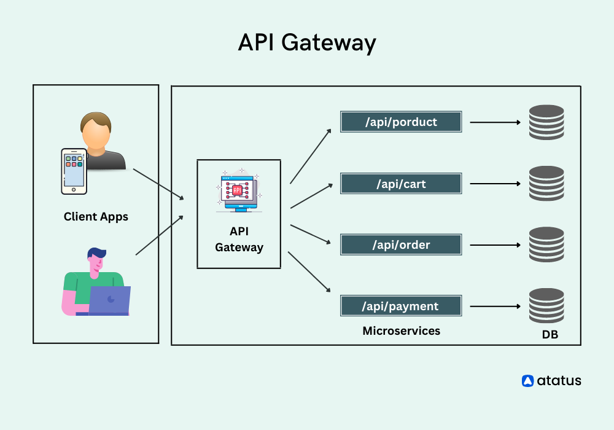
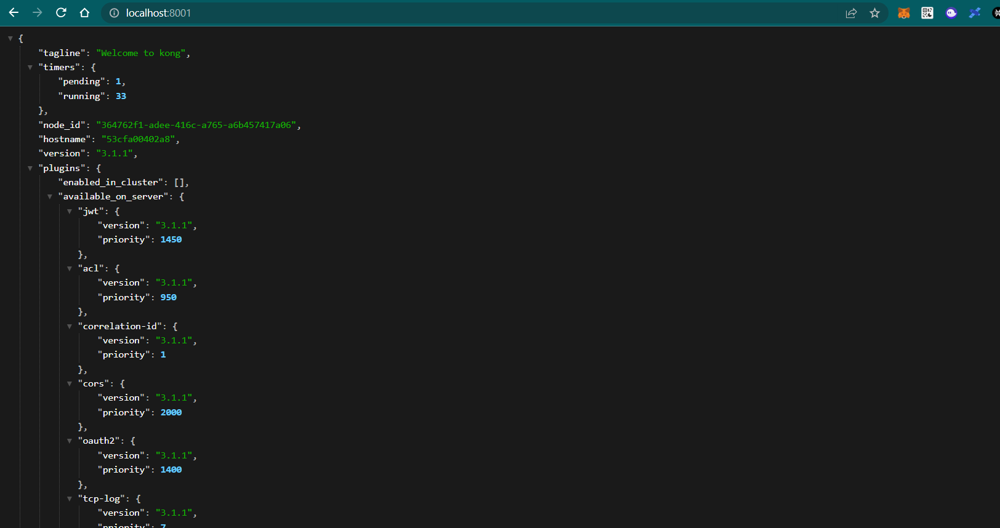
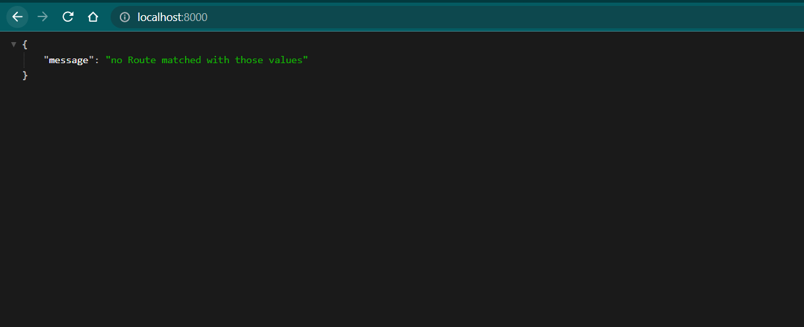
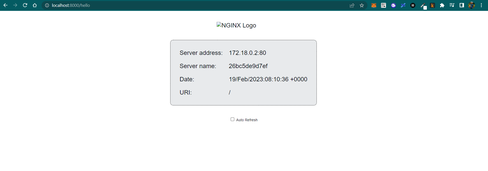

## Contenido

- ¿Que es un API Gateway?
- ¿Porque deberias utilizar este componente en tu infrastructura?
- Kong API Gateway
- Instalar y configurar Kong API Gateway
- Añadir un servicio y su regla de ruteo
- Autenticacion de nuestras APIs
- Proximos pasos

### ¿Que es un API Gateway?

Un API Gateway  es un componente de software que actúa como punto de entrada para todas las solicitudes de una API. Se encarga de recibir las solicitudes de los clientes, dirigirlas a los servicios adecuados y devolver las respuestas resultantes. Es un componente muy comun en las arquitecturas de microservicios, ya que centraliza el acceso a los microservicios-

Actúa como intermediario entre los clientes y los servicios de la aplicación que se ejecutan en distintos servidores o plataformas. Permite que los desarrolladores implementen y administren de manera centralizada diferentes versiones de las API, a la vez que controlan el acceso a ellas.

Además, el API Gateway proporciona una capa de seguridad para proteger la API de posibles amenazas externas.

En resumen, un API Gateway es un componente esencial para la creación, gestión y monitorización de APIs, que ofrece seguridad, escalabilidad y flexibilidad para las aplicaciones modernas.



### ¿Porque deberias utilizar este componente en tu infrastructura?

1. Facilita la creación de APIs consistentes: El API Gateway permite definir un conjunto de políticas de seguridad, autenticación, autorización y otras políticas que se aplican a todas las APIs que pasan a través de él.
2. Mejora la seguridad: Al centralizar el acceso a las APIs, el API Gateway puede actuar como un punto de control para aplicar políticas de seguridad.
3. Mejora el rendimiento y la escalabilidad: El API Gateway puede actuar como un balanceador de carga y distribuir el tráfico a diferentes instancias de la API en función de la carga.
4. Simplifica la gestión de APIs: El API Gateway facilita la gestión de las APIs, proporcionando una única interfaz para administrar todas las APIs.

### Kong API Gateway

Kong API Gateway es un API Gateway de código abierto que actúa como un proxy inverso para las solicitudes de API y proporciona un conjunto de herramientas y servicios para administrar, monitorear y asegurar el tráfico de la API.

Algunas de las características y funcionalidades de Kong incluyen:

- Proxy inverso para enrutar el tráfico de la API a los servicios de backend
- Caching de respuestas para mejorar el rendimiento
- Autenticación y autorización de usuarios con diferentes métodos de autenticación, incluyendo JWT y OAuth 2.0
- Registro y seguimiento del tráfico de la API para fines de análisis y monitorización
- Balanceo de carga para distribuir el tráfico de la API a diferentes nodos de backend

### Instalar y configurar Kong API Gateway

Kong nos ofrece diferentes formas de instalarlo segun la documentacion ofical [https://docs.konghq.com/gateway/3.1.x/install/](https://docs.konghq.com/gateway/3.1.x/install/).

En este tutorial instalaremos Kong a traves de Docker. Ademas, Kong te ofrece la posibilidad de configurarlo **con una base de datos** (donde almacenara las configuraciones) o **sin una base de datos** (almacenara las configuraciones en memoria). Se recomienda para desarrollo local elegir la opcion sin base datos ya que es menos compleja.

Para eso crearemos una carpeta donde estaran las configuraciones de nuestro API Gateway.

En mi caso la nombrare `kong`

```bash
ldamore@Desktop:~ $ mkdir kong
ldamore@Desktop:~ $ cd kong
```

A continuacion crearemos un archivo `docker-compose.yml` donde declaremos nuestro API Gateway con el siguiente contenido:

```docker
version: "3.8"

networks:
 kong-net:
  external: true

services:
  kong:
    container_name: kong
    build:
      context: .
      dockerfile: Dockerfile
    restart: unless-stopped
    networks:
      - kong-net
    healthcheck:
      test: [ "CMD", "curl", "-f", "http://kong:8000" ]
      interval: 5s
      timeout: 2s
      retries: 15
    environment:
      - KONG_DATABASE=off
      - KONG_ADMIN_LISTEN=0.0.0.0:8001
      - KONG_PROXY_ACCESS_LOG=/dev/stdout
      - KONG_ADMIN_ACCESS_LOG=/dev/stdout
      - KONG_PROXY_ERROR_LOG=/dev/stderr
      - KONG_ADMIN_ERROR_LOG=/dev/stderr
      - KONG_DECLARATIVE_CONFIG=/kong/declarative/kong.yml
    ports:
      - 8000:8000
      - 8443:8443
      - 8001:8001
      - 8444:8444
      - 8002:8002
      - 8445:8445
      - 8003:8003
      - 8004:8004
```

- KONG_DATABASE= off ya que usaremos kong sin base de datos
- KONG_ADMIN_LISTEN el host y el puerto de la api para administrar Kong
- KONG_PROXY_ACCESS_LOG, KONG_ADMIN_ACCESS_LOG, KONG_PROXY_ERROR_LOG, KONG_ADMIN_ERROR_LOG en estas variables definiremos el path para los logs
- KONG_DECLARATIVE_CONFIG el path donde estara la configuracion de nuestros servicios y las reglas de ruteo

Ademas deberemos crear un Dockerfile que se encargara de copiar nuestro archivo de configuracion de nuestros servicios al container de Kong

Crear Dockerfile con el siguiente contenido:

```docker
FROM kong
USER 0
RUN mkdir -p /kong/declarative/
COPY config/kong.yml /kong/declarative/
RUN cp /etc/kong/kong.conf.default /etc/kong/kong.conf
USER kong
```

Por ultimo crearemos el archivo de configuracion de nuestros servicios y reglas de ruteo. Que en principio estara vacio.

Crear carpeta config y archivo kong.conf dentro de ella:

```bash
ldamore@Desktop/kong:~ $ mkdir config
ldamore@Desktop/kong:~ $ cd config
ldamore@Desktop/kong:~ $ touch kong.config
```

El contenido del archivo kong.conf, en principio, es el siguiente:

```
_format_version: "3.0"
 _transform: true
```

Una vez creado el archivo, volvemos a la carpeta raiz donde esta el docker-compose.yml y el Dockerfile y ejecutamos el siguiente comando:

```bash
ldamore@Desktop/kong:~ $ docker-compose up --build -d
```

Si ingresamos a [http://localhost:8001](http://localhost:8001) podremos ver la configuracion de nuestro Kong API Gateway



El punto de entrada a nuestras api es en el puerto 8000, si lo visitamos veremos lo siguiente:



Esto quiere decir que aun no tenemos ninguna regla de ruteo. Lo siguiente que haremos es agregar un nuevo servicio con su regla de ruteo.

### Añadir un servicio y su regla de ruteo

Una vez que ya tenemos configurado Kong podremos añadir nuevos servicios para que este rediriga el trafico hacia ellos, segun reglas de ruteo.

En el archivo `config/kong.yml` agregaremos lo siguiente:

```
_format_version: "3.0"
 _transform: true

 services:
  - name: hello-world-server
    url: http://your-ip:8484
    routes:
    - name: hello
      paths:
      - /hello
```

Tener en cuenta que en donde dice `your-ip` debemos poner nuestra ip local (Podremos saberla con el comando `ifconfig` en Linux y en Windows con `ipconfig`)

En este archivo estamos definiendo que toda peticion que entre a nuestro API Gateway con el path /hello sera direccionada a nuestro servicio.

Por ultimo debemos añadir el servicio a nuestro archivo `docker-compose.yml`

```docker
version: "3.8"

networks:
 kong-net:
  external: true

services:
  kong:
    container_name: kong
    build:
      context: .
      dockerfile: Dockerfile
    restart: unless-stopped
    networks:
      - kong-net
    healthcheck:
      test: [ "CMD", "curl", "-f", "http://kong:8000" ]
      interval: 5s
      timeout: 2s
      retries: 15
    environment:
      - KONG_DATABASE=off
      - KONG_ADMIN_LISTEN=0.0.0.0:8001
      - KONG_PROXY_ACCESS_LOG=/dev/stdout
      - KONG_ADMIN_ACCESS_LOG=/dev/stdout
      - KONG_PROXY_ERROR_LOG=/dev/stderr
      - KONG_ADMIN_ERROR_LOG=/dev/stderr
      - KONG_DECLARATIVE_CONFIG=/kong/declarative/kong.yml
    ports:
      - 8000:8000
      - 8443:8443
      - 8001:8001
      - 8444:8444
      - 8002:8002
      - 8445:8445
      - 8003:8003
      - 8004:8004
  helloworldserver:
    image: dockerbogo/docker-nginx-hello-world
    networks:
      - kong-net
    ports:
      - 8484
```

Para nuestro servicio usaremos una imagen de nginx para testear. Pero podemos poder cualquier api con un servidor http.

Actualizamos los containers:

```bash
ldamore@Desktop/kong:~ $ docker-compose down
ldamore@Desktop/kong:~ $ docker-compose up --build -d
```

Ahora si entramos a [http://localhost:8000/hello](http://localhost:8000/hello) podemos ver que el API Gateway nos enviara a nuestro servicio



### Autenticacion de nuestras APIs

Para finalizar este tutorial veremos como proteger nuestras apis de peticiones de clientes no autorizadas.

Kong nos ofrece una amplia libreria de Plugins con diferentes metodos de autenticacion para nuestras apis.

Los mas comunes son los siguientes:

- Key Authentication
- Basic Authentication
- OAuth 2.0 Authentication
- LDAP Authentication Advanced
- OpenID Connect

En este tutorial utilizaremos el metodo **Key Authentication.** Con este metodo, debemos generar y asociar una key API con un consumidor. Esa key es el secreto de autenticación presentado por el cliente al realizar peticiones. Kong Gateway aprueba o niega las peticiones en función de la validez de la clave presentada.

**Key Authentication** en Kong Gateway funciona mediante el uso del objeto consumidor. Las claves se asignan a los consumidores y las aplicaciones cliente presentan la clave en las peticiones que realizan.

Lo primero que debemos hacer es crear un consumidor, donde debemos asignarle un nombre:

```bash
ldamore@Desktop/kong:~ $ curl -i -X POST http://localhost:8001/consumers/ \
  --data username=my-consumer
```

Lo siguiente es asignar una Key al nuevo consumidor:

```bash
ldamore@Desktop/kong:~ $ curl -i -X POST http://localhost:8001/consumers/luka/key-auth \
  --data key=top-secret-key
```

El plugin de **Key Authentication** esta instalado por defecto en Kong API Gateway, solo debemos activarlo:

```bash
ldamore@Desktop/kong:~ $ curl -X POST [http://localhost:8001/plugins/](http://localhost:8001/plugins/) \
--data "name=key-auth"  \
--data "config.key_names=apikey"
```

Ahora si enviamos una peticion a nuestro servicio, con una api key incorrecta resibiremos lo siguiente:

```bash
ldamore@Desktop/kong:~ $ curl -i [http://localhost:8000/mock/request](http://localhost:8000/mock/request) \
-H 'apikey:bad-key'
```

```
HTTP/1.1 401 Unauthorized
...
{
  "message":"Invalid authentication credentials"
}
```

Para enviar una peticion valida debemos enviar la Key correcta:

```bash
ldamore@Desktop/kong:~ $ curl -i [http://localhost:8000/](http://localhost:8000/mock/request)hello \
-H 'apikey:top-secret-key'
```

### Proximos pasos

Vimos como Kong API Gateway nos ayuda a administrar nuestras apis. Este tutorial fue hecho para probar esta herramienta en entorno de desarrollo.

En otro post veremos como usar Kong en produccion desplegandolo en AWS.
