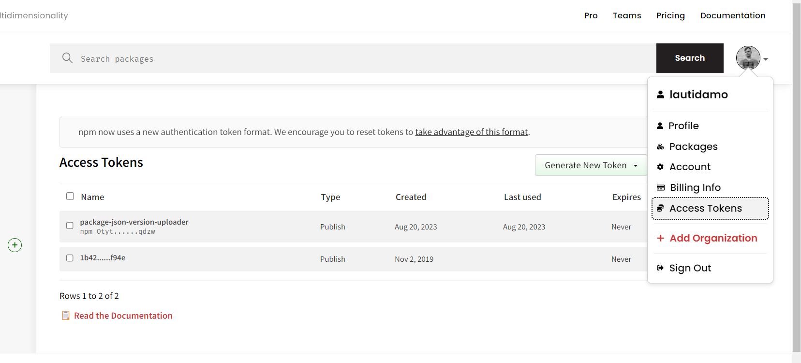

### Inicializar proyecto y agregar dependencias

Lo primero es inicializar nuestro proyecto y agregar las dependencias que necesitamos. En mi caso voy a estar usando la nueva version de [yarn](https://yarnpkg.com/).

Para iniciar el proyecto usaremos los siguiente comandos:

```bash
ldamore@Desktop:~ $ mkdir my-npm-package
ldamore@Desktop:~ $ cd my-npm-package
ldamore@Desktop/my-npm-package:~ $ yarn init
```

Y luego agregamos las dependencias que necesitamos. En mi caso voy a usar:

- [builder bob](https://github.com/callstack/react-native-builder-bob): Herramienta que nos ayuda a bundlear nuestro codigo para distribucion
- [Typescript](https://www.typescriptlang.org/): Javascript con sintaxis de tipos.
- [eslint](https://eslint.org/): Herramienta que nos ayuda analizar nuestro codigo y encontrar bugs.

No es necesario que instales typescript y eslint, eso va a depender de como armes tu paquete.

Agregamos las dependencias:

```bash
ldamore@Desktop/my-npm-package:~ $ yarn add --dev @types/node @typescript-eslint/eslint-plugin @typescript-eslint/parser eslint react-native-builder-bob typescript
```

### Configurar Builder bob

Una vez instalada las dependencias debemos configurar la herramienta Builder bob para que buildee nuestro codigo para produccion. Para eso debemos hacer algunos ajustes en el package.json

```json
{
  "name": "my-npm-package",
  "version": "0.1.o",
  "description": "Simple package",
  "main": "dist/commonjs/index.js", // add this line
  "module": "dist/module/index.js", // add this line
  "types": "dist/typescript/index.d.ts", // if you configure typescript, add this line
  "files": [
    "src",
    "dist",
    "README.md",
    "LICENSE"
  ], // add this lines
  "scripts": {
    "build": "bob build" // add this line
  },
  "devDependencies": {
    "@types/node": "^20.5.0",
    "@typescript-eslint/eslint-plugin": "^6.4.0",
    "@typescript-eslint/parser": "^6.4.0",
    "eslint": "^8.47.0",
    "react-native-builder-bob": "^0.20.4",
    "typescript": "^5.0.4"
  },
  "react-native-builder-bob": {
    "source": "src",
    "output": "dist",
    "targets": [
      "commonjs",
      "module",
      "typescript"
    ]
  }, // add this lines
  "engines": {
    "node": ">= 18.0.0"
  },
  "publishConfig": {
    "registry": "https://registry.npmjs.org/"
  }, // add this lines
  "packageManager": "yarn@3.6.1"
}
```

Vamos paso por paso para explicar cada linea:

- **“main”:** Indica el punto de entrada de nuestro paquete. Se suele poner el path al codigo buildeado con el sistema de modulos **commonjs (module.exports/require)**. Builder bob nos creara este codigo.
- **“module”:** Indica el punto de entrada de nuestro paquete pero con el sistema de **module (exports/imports)**.  Builder bob nos creara este codigo.
- **“types”:** Opcional. Si nuestro codigo esta en typescript indica el path a los tipos de nuestro paquetes. Builder bob nos proporcionara estos tipos.
- **“files”:** Indica que archivos incluiremos en el paquete. La carpeta dist (creada una vez que buildeemos nuestro codigo con Builder bob) es obligatoria. Luego poderemos añadir opcionalmente src (recomendable para que quienes instalen el paquete tengan acceso al codigo fuente y no solo al codigo bundleado). Tambien se pueden añadir opcionalmente README.md y LICENSE o todos los archivos que querramos (se recomienda el minimo posible asi el paquete no pesa tanto)
- **“scripts”:** Dentro de script agregaremos el comando `“build": "bob build"` para poder luego ejecutarlo y asi bob buildeara nuestro codigo para distribucion.
- “**react-native-builder-bob**”: Aqui es donde configuraremos a builder bob para que buildee nuestro codigo. En mi caso le especifico que tome el codigo de la carpeta **src** y que el output sea en la carpeta **dist.** Ademas le especificamos los 3 targets posibles: **commonjs, module & typescript.** Si usted no usa typescript, no es necesario especificarlo.
- “**publishConfig**”: Indica a que registry vamos a subir el paquete, en nuestro caso sera el registry oficial de npm

### Configuracion de Typescript y eslint (opcional)

Este paso es para quienes tienen su proyecto en Typescript y usan eslint. A continuacion mostrare la configuracion que yo utilizo en el proyecto

tsconfig.json:

```json
{
  "compilerOptions": {
    "baseUrl": "./",
    "allowUnreachableCode": false,
    "allowUnusedLabels": false,
    "allowJs": true,
    "allowSyntheticDefaultImports": true,
    "esModuleInterop": true,
    "forceConsistentCasingInFileNames": true,
    "lib": ["esnext"],
    "module": "esnext",
    "moduleResolution": "node",
    "noFallthroughCasesInSwitch": true,
    "noImplicitReturns": true,
    "noImplicitUseStrict": false,
    "noImplicitAny": false,
    "strictNullChecks": false,
    "noStrictGenericChecks": false,
    "noUncheckedIndexedAccess": true,
    "noUnusedLocals": true,
    "noUnusedParameters": false,
    "resolveJsonModule": true,
    "skipLibCheck": true,
    "strict": false,
    "target": "esnext",
    "declaration": true,
    "outDir": "dist",
    "isolatedModules": true
  },
  "include": ["src"]
}
```

.eslintrc.js

```jsx
module.exports = {
  root: true,
  extends: ['eslint:recommended'],
  parser: '@typescript-eslint/parser',
  plugins: ['@typescript-eslint'],
  env: {
    es6: true,
    jest: true,
  },
  globals: {
    module: false,
    require: false,
    console: true,
    process: true
  },
  rules: {
    'semi': ['error', 'never'],
    'curly': ['error', 'multi-line'],
    'object-curly-spacing': [ 'error', 'always' ],
    'dot-notation': 'off',
    '@typescript-eslint/no-shadow': 'off',
    '@typescript-eslint/semi': ['error', 'never'],
    '@typescript-eslint/no-unused-vars': [
      'warn', {
        'vars': 'all',
        'args': 'none',
        'ignoreRestSiblings': false,
      }],
  },
  ignorePatterns: ['dist/'],
}
```

### Codear

Por ultimo nos queda codear la funcionalidad de nuestro paquete. Ya que esto es un post que explica como subir un paquete a npm, la funcionalidad sera muy basica porque no pretende hacer incapie en eso. Es simplemente para testear la subida del paquete.

Por eso el siguiente paso sera crear la carpeta **src** (carpeta donde le indicamos a bob que estara nuestro codigo) y crear un archivo **index.ts** (o **index.js** si no utilizan typescript) con alguna funcionalidad adentro.

**src/index.ts**

```tsx
export const sum = (a: number, b: number) => return a + b
```

### Buildear & Publicar

Lo ultimo que nos queda es buildear y publicar nuestro paquete. Para buildear debemos correr el comando ya creado **build:**

```bash
ldamore@Desktop/my-npm-package:~ $ yarn build
```

Eso nos creara una carpeta dist con los **targets** especificados previamente:


Por ultimo para publicar nuestro paquete debemos crear en la raiz de nuestro proyecto un archivo llamado **.yarnrc.yml** con el siguiente contenido:

```yaml
npmAuthToken: npm_your-npm-token
```

Este archivo indicara las credenciales de nuestra cuenta npm para poder hacer login y publicar nuestro paquete.

Es requerido antes tener una cuenta en npm e ir a la seccion de access token y generar un nuevo token para poder publicar.



### Configurar Github Actions (opcional)

Para poder hacer el proceso de publicacion mas automatico podemos utilizar github actions (o cualquier otro ci) para automatizar estas tareas.

Para eso crearemos las siguientes carpetas y archivo en la raiz.

.github/workflows/main.yml

```yaml
name: Build & Publish

on: [push]

jobs:
  test:
    runs-on: ubuntu-latest
    steps:
      - uses: actions/checkout@v3
      - name: Set up Node
        uses: actions/setup-node@v3
        with:
          node-version: '18'
          cache: 'yarn'
          registry-url: 'https://registry.npmjs.org'
      - name: Install modules
        run: yarn install --immutable
      - name: Run lint
        run: yarn lint

  publish:
    runs-on: ubuntu-latest
    needs: test
    if: startsWith(github.ref, 'refs/tags/release-')
    steps:
      - uses: actions/checkout@v3
      - name: Set up Node
        uses: actions/setup-node@v3
        with:
          node-version: '18'
          cache: 'yarn'
          registry-url: 'https://registry.npmjs.org'
      - name: Install modules
        run: yarn install --immutable
      - name: Build
        run: yarn build
      - name: Publish to npm
        run: npm publish --access public
        env:
          NODE_AUTH_TOKEN: ${{ secrets.NPM_TOKEN }}
```

Este workflow indica que antes un push se lintea el paquete y ante un tag con la regex release- se hace una publicacion. Es importante configurar en los secretos del repo el **NPM_TOKEN**
