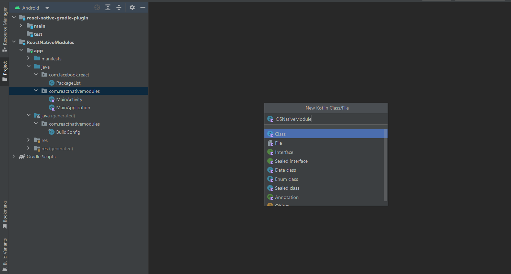
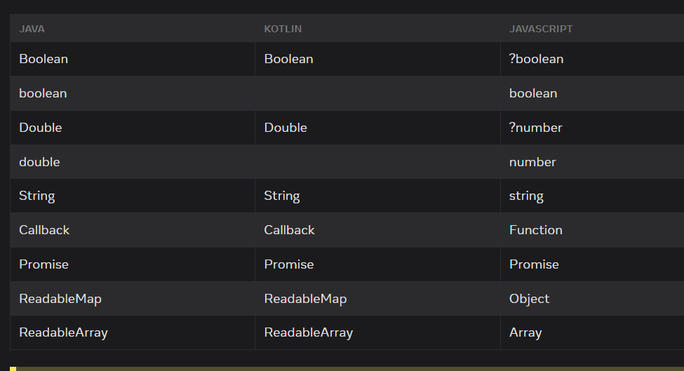
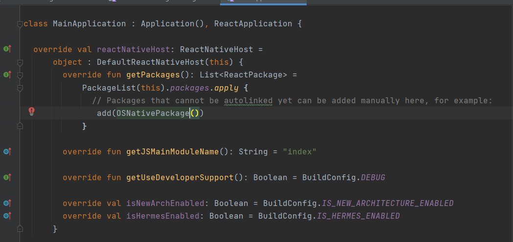

### Introducción

A veces, una aplicación de React Native necesita acceder a una API nativa de la plataforma que no está disponible por defecto en JavaScript, como por ejemplo las APIs nativas de Apple o Google Pay. O Tal vez desees reutilizar algunas bibliotecas existentes de Objective-C, Swift, Java, Kotlin o C++ sin tener que reimplementarlas en JavaScript.

El sistema NativeModule de React Native expone instancias de clases nativas de Java/Kotlin/Objective-C/Swift a JavaScript como objetos, lo que te permite ejecutar código nativo desde dentro de JS.

En este ejemplo vamos a crear nuestros propios modulos de Android y iOS para acceder a funcionalidad nativa. Como este es un tutorial para aprender como conectarnos con la parte nativa, el ejemplo sera sencillo. Solo preguntaremos a la parte nativa la version de Android y iOS dependiendo el sistema operativo que estemos usando.

### Setup React Native

Dependiendo de tu sistema operativo tendras que realizar diferentes paso. Te recomiendo seguir paso por paso el tutorial de la pagina oficial de [React Native](https://reactnative.dev/docs/0.72/environment-setup).

### Crear proyecto react native

```bash
ldamore@Desktop:~ $ npx react-native@latest init ReactNativeModules
```

### Android modules

Lo primero es abrir el proyecto `android` con el android studio.
Para eso abriremos `nuestroproyecto/android`
Creamos una clase dentro de `app/java` con el nombre que querramos eligiendo Java o Kotlin, en mi caso eligire Kotlin y la llamare `OSNativeModule`.



Y agregamos el siguiente codigo:

```kotlin
package com.reactnativemodules

import com.facebook.react.bridge.ReactApplicationContext
import com.facebook.react.bridge.ReactContextBaseJavaModule

class OSNativeModule(reactContext: ReactApplicationContext) : ReactContextBaseJavaModule(reactContext) {

	override fun getName() = "OSNativeModule"

}
```

Algunas cosas:

- Para que una clase sea considero modulo nativo en React Native deben implementar la clase `ReactContextBaseJavaModule`
- La clase base nos da acceso a `ReactApplicationContext` que es util por si los modulos necesitan manipular los ciclos de vida la actividad.
- El metodo getName: En ese metodo debemos poner el nombre de nuestro modulo que luego invocaremos en JavaScript del lado de ReactNative. Este nombre es importante porque un error de tipeo nos provocaria que ReactNative no encuentre este modulo.

Ahora vamos a desarrollar la funcionalidad de nuestro modulo. Para este ejemplo haremos algo sencillo, como consultar la version del sistema operativo. Pero no hay que olvidar que aqui podremos hacer todo lo nativo que podemos hacer en Android

Dentro de la clase `OSNativeModule` escribiremos lo siguiente:

```kotlin

package com.reactnativemodules

import com.facebook.react.bridge.Promise
import com.facebook.react.bridge.ReactApplicationContext
import com.facebook.react.bridge.ReactContextBaseJavaModule
import com.facebook.react.bridge.ReactMethod

class OSNativeModule(reactContext: ReactApplicationContext): ReactContextBaseJavaModule(reactContext) {

	@ReactMethod
	fun getOSVersion(promise: Promise) {
	    val version = android.os.Build.VERSION.SDK_INT
	    val versionName = android.os.Build.VERSION.RELEASE
	    promise.resolve("Android Version: $versionName (API Level $version)")
	}

	override fun getName() = "OSNativeModule"
}
```

}

Todos los métodos de módulos nativos destinados a ser invocados desde JavaScript deben estar anotados con `@ReactMethod`.

Los metodos nativos, ademas de los parametros que le podemos enviar al metodo, recibe opcionalmente un parametro que es proporcionado por React Native.

Este parametro es el parametro promise y es el que nos permite resolver un tipo de dato o rechazar con un error.

Los tipos de datos que se pueden devolver hasta el momento son los siguientes:



Lo siguiente es añadir nuestros modulos al `PackageList` de React Native.

Para eso creamos una nueva clase kotlin al lado de la anterior en  `app/java` en mi caso con el nombre `OSNativePackage`

Y con el siguiente codigo:

```kotlin
package com.reactnativemodules

import android.view.View
import com.facebook.react.ReactPackage
import com.facebook.react.bridge.NativeModule
import com.facebook.react.bridge.ReactApplicationContext
import com.facebook.react.uimanager.ReactShadowNode
import com.facebook.react.uimanager.ViewManager

class OSNativePackage: ReactPackage {

	override fun createViewManagers(
	    reactContext: ReactApplicationContext
	): MutableList<ViewManager<View, ReactShadowNode<*>>> = mutableListOf()

	override fun createNativeModules(
	    reactContext: ReactApplicationContext
	): MutableList<NativeModule> = listOf(OSNativeModule(reactContext)).toMutableList()
}
```

En el metodo `createNativeModules` debemos agregar todos nuestros modulos nativos, en este caso `OSNativeModule`

Y en `app/java/MainApplication` agregamos nuestro package:



Y hasta aca ya tenemos todo para probar nuestro modulo nativo de Android.

### iOS

Lo primero es abrir el workspace dentro de la carpeta nuestroproyecto/ios con xcode.

Luego crearemos un archivo .m donde definiremos nuestro modulo y lo exportaremos. Opcionalmente podemos usar swift e importar nuestra clase swift en este archivo para exportarla.

Creamos el archivo `OSNativeModule.m` con el siguiente codigo:

```objectivec
#import <React/RCTBridgeModule.h>

@interface RCT_EXTERN_MODULE(OSNativeModule)

    RCT_EXTERN_METHOD(getOSVersion: (RCTPromiseResolveBlock) resolve
                      rejecter: (RCTPromiseRejectBlock) reject)

    + (BOOL)requiresMainQueueSetup {
      return NO;
    }
@end
```

Las macros `RCT_EXPORT_MODULE` y `RCT_EXTERN_METHOD` , exportan y registran el modulo y los metodos en React Native. Es importante que el modulo que estemos exportando tenga el mismo nombre en Android

Y un archivo swift `OSNativeModule.swift` con el siguiente codigo:

```swift

@objc(OSNativeModule)
class OSNativeModule {

    @objc(getOSVersion:rejecter:)
    func getOSVersion(resolve: RCTPromiseResolveBlock, reject: RCTPromiseRejectBlock) -> Void {
        resolve(UIDevice.current.systemVersion)
    }

}

```

### React Native

Del lado de javascript, React native nos proporciona el objecto `NativeModules` y desde alli podemos acceder a nuestro modulo.

El siguiente codigo se comunica con nuestro modulo `OSNativeModule` y llama al metodo `getOSVersion` para mostrarlo en la pantalla. Por detras react native se esta comunicando con la parte nativa.

```tsx
import React, {useState} from 'react';
import {Button, Text, View} from 'react-native';
import {NativeModules} from 'react-native';

function App(): React.JSX.Element {
const {OSNativeModule} = NativeModules;
const [osVersion, setOsVersion] = useState<string>('');

function onPress() {
	return async () => {
		const osVersion = await OSNativeModule.getOSVersion();
		setOsVersion(osVersion);
	};
}

return (
	<View>
		<Text>Get OS version</Text>
		<Button title="Click to get version" onPress={onPress()} />
		<Text>Version: {osVersion}</Text>
	</View>
);
}

export default App;
```
